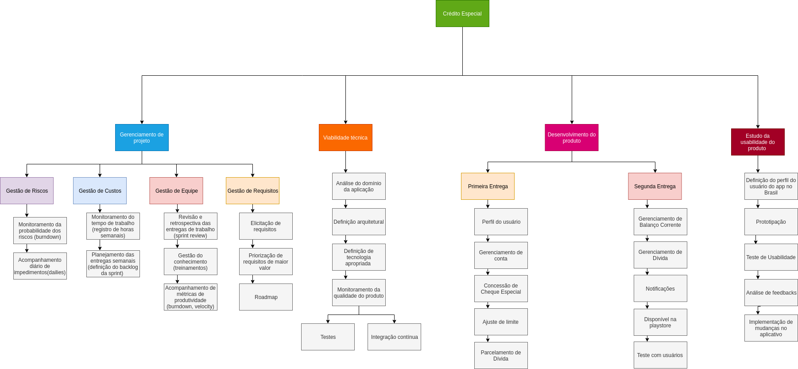
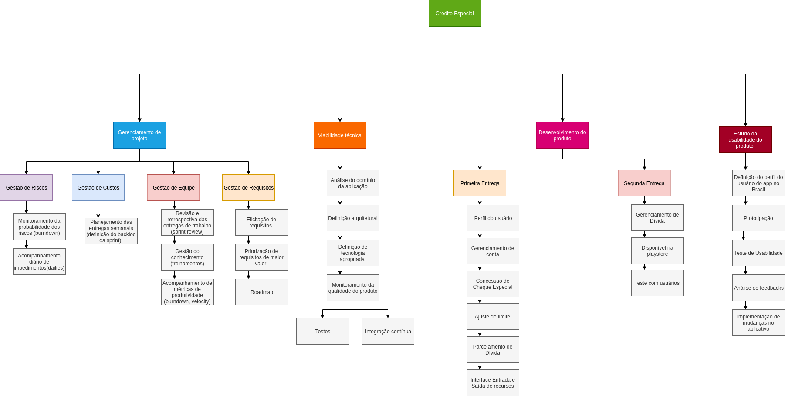

# Estrutura Analítica do Projeto

* [1. Sobre](#_1-Sobre)
* [2. Versão 1](#_2-Versão-1)
* [3. Versão 2](#_3-Versão-2)
* [4. Versão 3](#_4-Versão-3)

# 1. Sobre

A Estrutura Analítica do Projeto consiste num documento que comporta pacotes de trabalhos que agregam valor ao projeto do ponto de vista do cliente. Esse artefato resume todas as atividades a serem desempenhadas no projeto para que a entrega final esteja de acordo ao esperado, fornecendo uma visão geral de toda a execução. Além disso, a partir deste é possível observar focos importantes para gestão de risco. As versões aqui apresentadas contemplam o escopo determinado e consideram aspectos importantes relacionados ao sucesso do projeto, como por exemplo gestão do time. 

# 2. Versão 1

# 3. Versão 2

# 4. Versão 3

# 5. Versão 4 

# Histórico de Versões

| Data | Versão | Autor(a) | Descrição |
| - | - | - | - |
| 12/09/2019 | 0.1 | Adrianne Alves | Elaboração da Estrutura analítica do Projeto |
| 13/09/2019 | 0.2 | Adrianne Alves | Atualização da Estrutura analítica do Projeto com considerações da Maria Luiza |
| 25/09/2019 | 0.3 | Adrianne Alves | Atualização da EAP versão 3 |
| 25/10/2019 | 0.4 | Adrianne Alves | Atualização da EAP versão 4 |