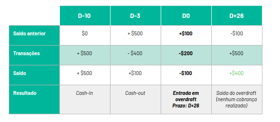
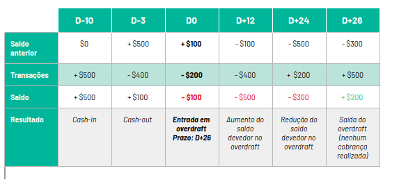
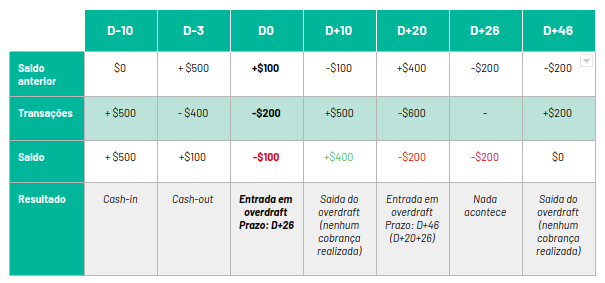
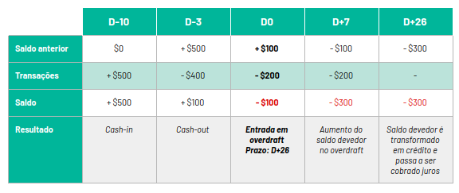

# Brainstorming

O brainstorming consiste numa técnica cujo objetivo é facilitar ou estimular a produção de ideias/soluções a respeito de um determinado tema. No contexto deste projeto essa técnica foi realizada principalmente durante as reuniões com o cliente. Isso porque consistiu na melhor oportunidade para angariar requisitos por meio da análise/observação por ponto de vista. Os resultados são explanados conforme relação abaixo:

## Primeira reunião

As primeira reunião com o Eduardo, destinaram-se ao conhecimento do universo de informações e contexto da problemática. 

### Resumo

A N26 surgiu a partir da ideia de um aplicativo para pagamento de mesadas e, após ter se consolidado conseguiu em 2016, na Alemanha, a licença de banco, expandindo rapidamente por toda a Europa. Entretanto, no Brasil, virá com a licença SCD - Sociedade de Crédito Direto, que permite que ofertem crédito apenas utilizando o próprio dinheiro da empresa. Nesse modelo, fornecerá ao público uma estrutura de conta de pagamento. Nesse contexto, o desafio foi definido como a funcionalidade de fornecer o cheque especial em conta de pagamento.

Ainda nesta reunião, falou-se a respeito dq experiência de usuário, visto que o produto funcionará como um MVP para testar a solução desse desafio. A única restrição, até o momento, foi manter as características de design e layout presentes na [aplicação original](https://www.youtube.com/watch?v=T6JfLJ1zaXA&feature=youtu.be). Além disso, a título de brainstorm, foram discutidas duas opções de oferta de cŕedito por cheque especial : Emitir nota a cada crédito consumido, substituindo o anterior existente e; Crédito num modelo chamado "guarda chuva".

Por fim, definiu-se que o projeto consistirá em um Mínimo Produto Viável cujo objetivo será testar a nova funcionalidade de oferta de cheque especial. Além do mais, definiu-se que em conjunto com a sua equipe, o cliente definiria o produto do ponto de vista de negócio, restringindo a nossa atuação à produção do protótipo e possíveis sugestões de mudanças. A partir daí, já foi possível definir alguns requisitos por meio de [introspecção](introspection.md) utilizando-se o [vídeo](https://www.youtube.com/watch?v=T6JfLJ1zaXA&feature=youtu.be) fornecido.

## Segunda reunião

Destinou-se a consolidar o escopo e características principais do projeto. 

### Resumo 

Algumas das necessidade básicas para o MVP levantadas, foram: Uma interface para simular a entrada e saída de dinheiro na aplicação, sendo os métodos de entrada por meio de boleto, TED ou transferência e de saída por uso de cartão ou boleto. Para isso, esperava-se que que houvesse uma interface em que após inserida determinada quantidade, a transação aparecesse para o usuário na timeline. Em termos de negação de pagamento ao cliente, a necessidade volta-se ao teste de experiência de usuário para identificar qual seria a melhor maneira de informá-lo a respeito disso.

Além disso, determinou-se que seria simulado o fluxo de contratação do serviço, referente ao mmomento em que a pessoa opta por utilizá-lo e o habilita. Nesse sentido, exclui-se o processo de análise de perfil do usuário. Tendo o usuário aceitado e ativado o serviço, ele terá acesso à uma tela de ajuste de limite, podendo ter acesso também aos juros recorrentes sobre o uso do mesmo. Em termos de regra de negócio, a proposta transformou-se em fornecer o serviço com 26 dias sem juros, contando a partir da primeira compra utilizando o cheque especial. Dessa forma, a maior preocupação consiste em deixar essa dinâmica clara para o usuário. Todas essas considerações foram melhor descritas no [documento de descrição dos requisitos funcionais](https://docs.google.com/document/d/1S0al6Z4P6rJorLjVkD2av7TU1E8fQpTlQlevRz-GGrA/edit?usp=sharing).

#### Sobre o documento

O documento descreve os requisitos funcionais para a oferta de cheque especial em uma 
conta de pagamento, cujo principal objetivo consiste em representar a entrada e saída de dinheiro/crédito a fim de simular situações de uso do cheque especial, com os planos de negócio da N26. Para isso, será utilizada a ideia de que existe um tipo único de usuário e focar-se-á em garantir transparência para o cliente; Simular custo efetivo de crédito (com as taxas recorrentes); Garantir que o cliente consiga acompanhar os dias em que está com a conta negativa.

##### Contextualização

A conta a ser utilizada tem o perfil pré-paga, alimentada por entradas de recursos. Em posse de um saldo o cliente consegue utilizar o cartão para compras, acompanhando as transações por meio de um histórico com valor, data, entre outros. Se o saldo for insuficiente, a conta será liberada para comprar desde que esteja apto a usar o cheque especial, entretanto o cliente só poderá utilizá-lo se ativar a função e aceitar os termos, de modo que o app libere imediatamente um limite determinado, quepoderá ser ajustado a fim de restringir os gastos por cheque especial. Além disso, será possível visualizar quanto do valor foi utilizado, as taxas de juro e como desabilitar o serviço.

A funcionalidade só poderá ser utilizada para compra com cartão, não para TED, Pagamento de Boleto e/ou transferência. A partir da primeira compra com o cheque especial, o cliente será notificado que entrou no serviço e terá 26 dias de crédito sem juros, sendo esse período possível quitar o saldo negativo por meio de entrada de recurso. Assim que o cliente sair da situação de cheque especial, ele deverá ser avisado e ao ser inserido recurso suficiente para quitar o saldo negativo, a contagem dos 26 dias será 
zerada, de modo a reiniciar com o próximo prazo de pagamento a partir da próxima transação em que ele utilizar overdraft.  

Se o crédito não for quitado no prazo de 26 dias, ele se transformará num empréstimo,incindindo os juros de 10% ao mês (0.3182% a.d). A transparência do processo será por meio de uma página contendo a incidência diária desse juros sobre o valor devido e a soma do saldo devedor.

De modo geral, existirão 4 cenários de uso do cheque especial, são eles: 

1. **Cenário 1** : O cliente entra em overdraft na D0 e insere recurso no valor de $500 para quitar o saldo negativo depois dos 26 dias. Nessa caso, nenhuma cobrança é realizada.

2. **Cenário 2** : O cliente entra em Overdraft em D0, aumenta o saldo devedor em D+12, diminui em D+24 e quita tudo em D+26 com uma entrada de $500. Também nesse caso, nenhuma cobrança é realizada.

3. **Cenário 3** : O cliente entra em Overdraft em D0, sai em D+10 com entrada de $500. Ele entra novamente em D+20, com um novo pravo sem juros até D+46, e ele quita o Overdraft. Nenhuma cobrança é realizada.

4. **Cenário 4** : O cliente entra em Overdraft em D0, aumenta a dívida em D+7 e não quita o saldo em D+26. O saldo é transformado em um crédito e passa a incidir juros.

O Eduardo deu total liberdade para modificar e sugerir novas formas de funcionamento, desde que seguisse a estrutura básica do serviço a ser implementado no Brasil, conforme especificado abaixo:

1. Entrada de recurso
2. Extrato das transações
3. Apresentação da funcionalidade e tarifas
4. Liberação do produto 
5. Aceite dos termos e condições
6. Gerenciamento de dias de cheque especial
7. Processo de transformação do cheque em empréstimo 
	- Apresentação
	- Como cobrar tarifas
	- Como cliente vai acompanhar o empréstimo
	- Como cliente vai pagar 
8. Retiradas de recursos (por compra)

