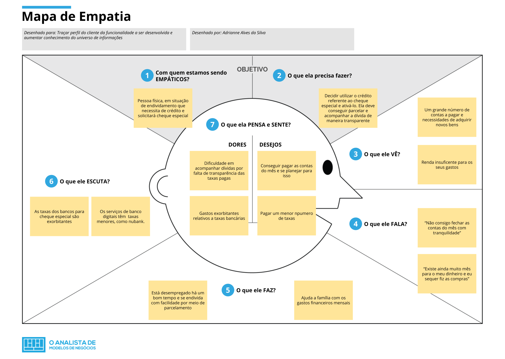

# Mapa de Empatia

O mapa de empatia é uma técnica utilizada para traçar o perfil do cliente. Por vezes, essa técnica auxilia na melhor definição do objetivo do projeto, pois mapeia a dor a ser sanada de um dos stakeholders, o usuário final do produto.

