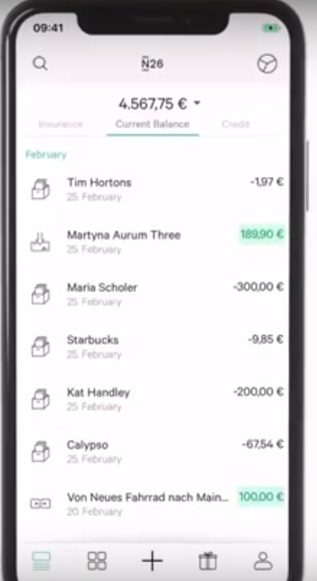
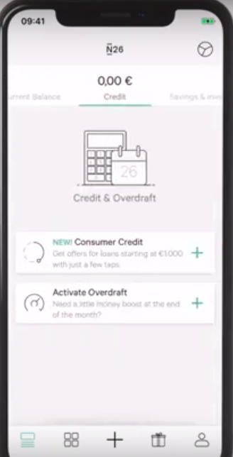
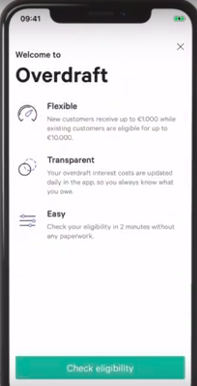
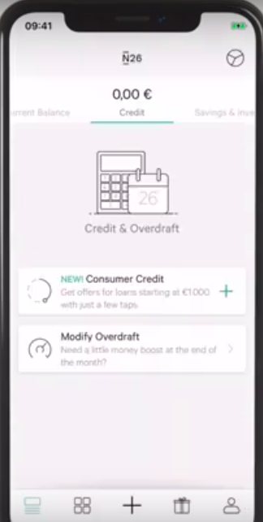
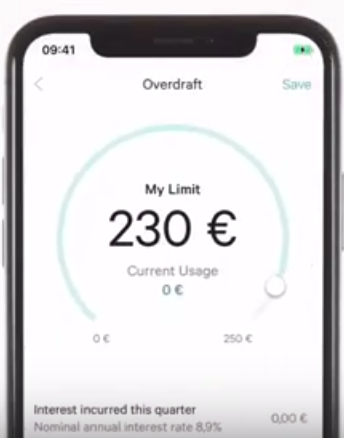

# Observação por Introspecção

A observação por introspecção consiste numa técnica utilizada para elicitação de requisitos na qual é preciso imaginar o tipo de sistema desejado a partir da ótica do usuário, a fim de este seja realmente útil. No caso deste projeto, utilizou-se o vídeo da aplicação utilizada no exterior para fundamentar as divagações e a observação de novos requisitos. Na realidade, esta foi a primeira técnica utilizada, visto que foi a primeira disponibilização de [material/informação](https://www.youtube.com/watch?v=T6JfLJ1zaXA&feature=youtu.be) pelo cliente.

* Observações gerais: 

    1. Extrato, visualização de saldo

    Será preciso que o usuário possa visualizar uma timeline de compras realizadas.

 
    2. Ativar overdraft 

    Para utilizar o serviço, ainda que seja elegível, o usuário deverá ativá-lo por meio do aplicativo.

 
    3. Explicação/apresentação do serviço,  checar elegibilidade

    O usuário poderá solicitar para que seja checada a sua elegibilidade ao serviço, além disso, deverá visualizar as vantagens de contratá-lo.

 
    4. Ativar o serviço após aprovado pedido 

    Assim que aprovado o serviço, deve estar disponível para o usuário uma forma de ativá-lo.

 
    5. Ajustar overdraft disponível

    É preciso que o usuário possa solicitar aumento do limite ou setar uma quantidade máxima que ele deseja usar.

 
    6. Acompanhar overdraft, cancelar overdraft

    É preciso que o usuário consiga visualizar rapidamente o limite restante disponível para gasto, o limite total e o limite já utilizado. Além disso, caso seja necessário, é preciso que exista uma maneira de cancelar ou desativar o serviço.

* Observações

No processo criativo de imaginar o produto ideal, surgem algumas observações importantes, por exemplo: Transparẽncia de gastos, transparência de taxas, controle sobre o uso do serviço, notificar sobre o uso do serviço, possuir um modo fácil de ajustar o overdraft.