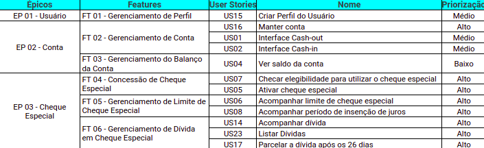

# Priorização 

A priorização foi realizada com uma simplificação da priorização do MOSCOW. Tal que a escala utilizada foi: Alta, média e baixa.

Considerando o backlog no contexto da disciplina, obteve-se: 

