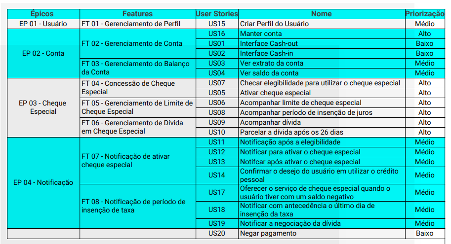
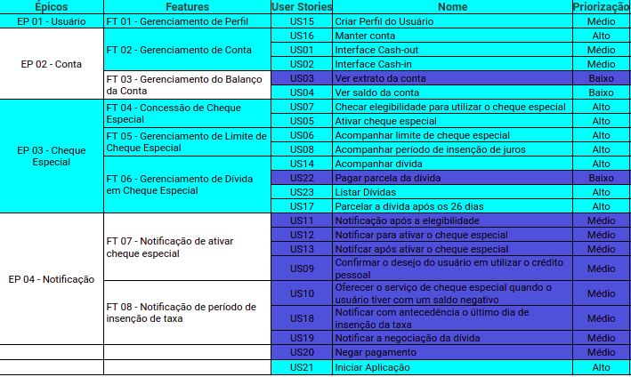

## Product Backlog

Após a consolidação do escopo do projeto, foi possível estabelecer um Backlog para o produto, conforme demonstrado abaixo.

## Versão Inicial

Após a primeira reunião com o cliente e discussões entre e algumas iterações, foi estabelecida a primeira versão do backlog, que se encontra abaixo.

## Versão Final

Ao longo do projeto foi necessária a constante atualização do backlog. Essa atualização, devido às constantes mudanças foi realizado diretamente na [planilha](https://docs.google.com/spreadsheets/d/1f1GQDp863DvVatqttrbRrIi0cP70PVSnYfms98DCM74/edit?usp=sharing) destinada para tal. 

Nesta versão foram priorizados os itens do fluxo principal que permite o uso do MVP para teste do fluxo. O épico central é o Cheque Especial, os demais foram constituídos a fim de obter uma experiência mais completa no aplicativo e/ou possibilitar o uso para teste. 

A última versão consolidada encontra-se abaixo, tal que os itens coloridos em verde foram concluídos, os itens em roxo foram removidos do fluxo a ser entregue no contexto da disciplina.

Abaixo, segue uma imagem das funcionalidades escolhidas para entrega no contexto da disciplina:

## Versão Final (Disciplina)

Após inúmeras discussões e repriorizações, chegou-se no seguinte backlog, tendo como contexto o desenvolvimento durante a disciplina.

