## Protótipos

A fim de validar e orientar o desenvolvimento da funcionalidade, referente ao fluxo de concessão, ativação e uso do cheque especial, foram realizados os protótipos de baixa e alta fidelidade, conforme apresentado abaixo.

#### 1. Protótipo de Baixa Fidelidade

#### 2. Protótipo de Alta Fidelidade

<h2>Versão 1</h2>

    
    
    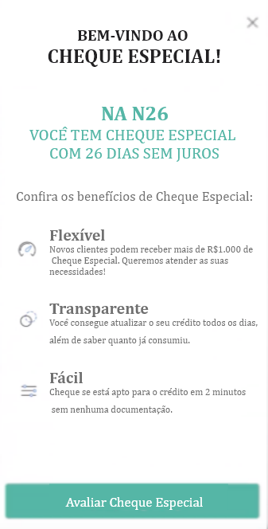
    
    
    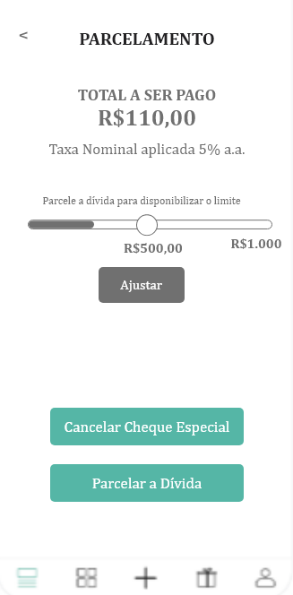
    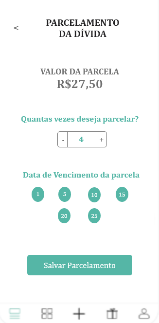
    
    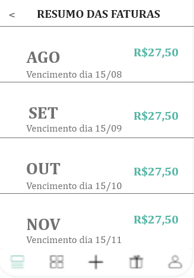
    

<h2>Versão 2</h2>

    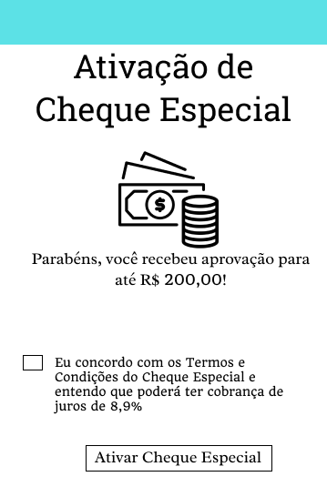
    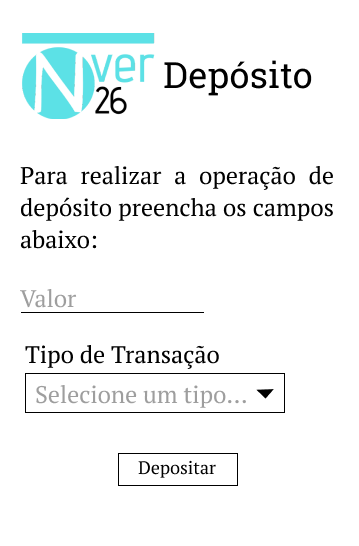
    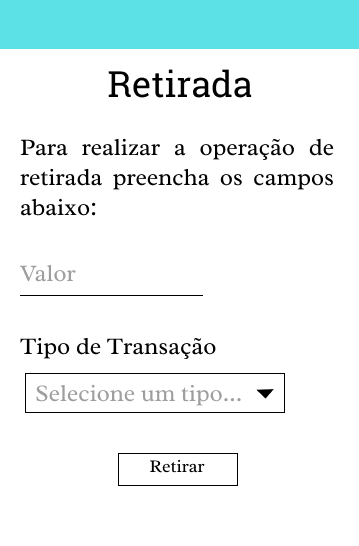
    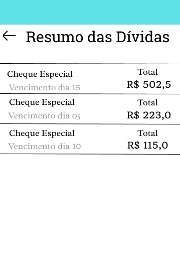
    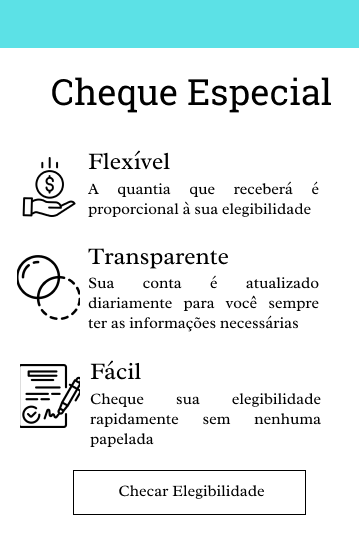
    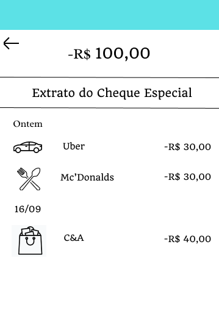
    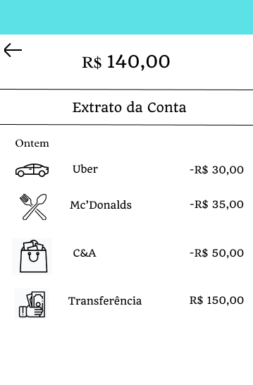
    
    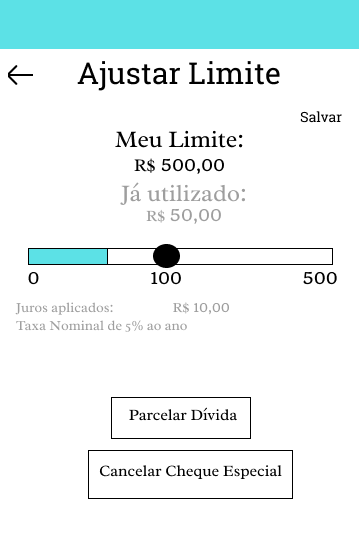
    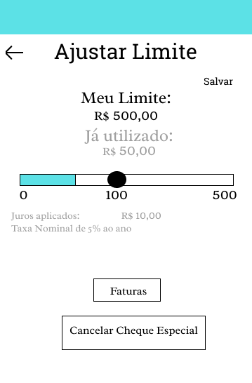
    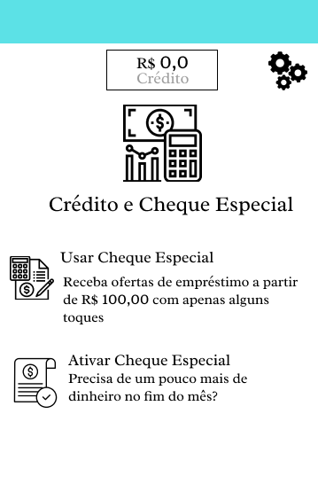
    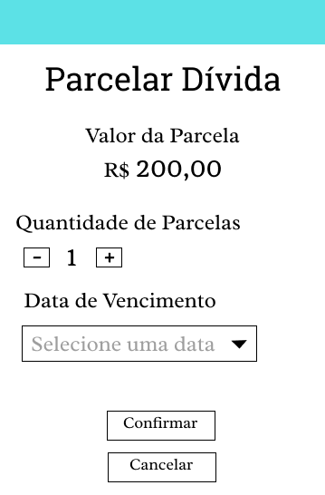
    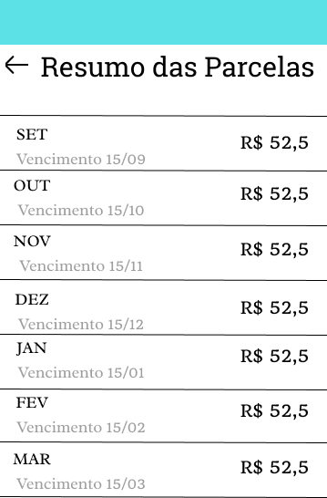

#### 3. Identidade Visual

| Tipo | Fonte | Tamanho | Cor|
| - | - | - | - |
| Título| Roboto Slab| 30 px| Preto (000000) |
| Texto com ênfase| Radley | 18 px| Preto (000000) |
| Texto sem ênfase| Radley| 16 px | Preto (000000)|
| Botões | Radley | 14 px | Preto (000000)|
| Números | Quando | 14 px | Preto (000000) |
| Texto de caixas de texto, vencimento e juros | Radley | 16 px | Cinza (9E9E9E) |

| Fundo | Cor | Código |
| - | - | - |
| Geral | Branco | FFFFFF |
| Faixa superior | Azul | 5CE1E6 |

| Tipo de Botão | Medidas (em px) |
| - | - |
| Pequeno (apenas uma palavra) | 120x33 |
| Grande (Mais de uma palavra) | 205x29 |