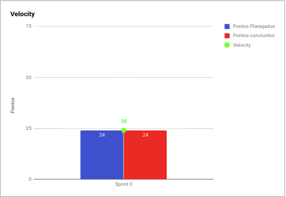
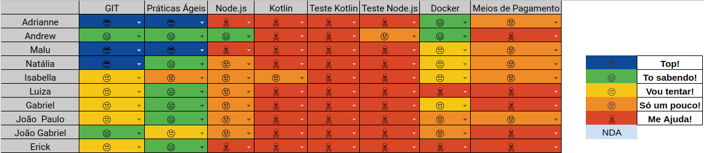

# Resultado

## 1. Indicadores de Produtividade da Equipe

### 1.1 Fechamento da Sprint 

**Pontos planejados: 24 pontos**
 
**Pontos concluídos: 24 pontos**

| Atividade | Situação |
| --------  | :----:   |
| [S01](https://github.com/fga-eps-mds/2019.2-Grupo2/issues/1)       |Concluída | 
| [S02](https://github.com/fga-eps-mds/2019.2-Grupo2/issues/2)       |Concluída | 
| [S03](https://github.com/fga-eps-mds/2019.2-Grupo2/issues/3)       |Concluída | 
| [S04](https://github.com/fga-eps-mds/2019.2-Grupo2/issues/9)       |Concluída | 
| [S05](https://github.com/fga-eps-mds/2019.2-Grupo2/issues/5)       |Concluída |
| [S06](https://github.com/fga-eps-mds/2019.2-Grupo2/issues/6)       |Concluída |
| [S07](https://github.com/fga-eps-mds/2019.2-Grupo2/issues/4)       |Concluída | 
| [S08](https://github.com/fga-eps-mds/2019.2-Grupo2/issues/13)       |Concluída | 
| [S09](https://github.com/fga-eps-mds/2019.2-Grupo2/issues/14)       |Concluída | 
| [S10](https://github.com/fga-eps-mds/2019.2-Grupo2/issues/15)       |Concluída |

## 1.2 Burndown

## 1.3 Velocity   

## 1.4 Retrospectiva 
| Membro | Pontos Positivos | Pontos Negativos | Sugestão de Melhoria | Pontuação das Histórias |
| --------  | :----:   | :----:   | :----:   | :----:   |
| Adrianne | EPS conseguiu dar treinamentos  | Não tínhamos tema e estávamos perdidos com relação ao escopo | Não se aplica | OK |
| Andrew | A equipe estava presente nos treinamentos | Não ter uma tecnologia definida o que atrasou os estudos | Não se aplica | OK |
| Maria Luiza | Definição das equipes | Não ter tema definido e nem tecnologia | Não se aplica | OK |
| Natália | Conseguiu mistrar os treinamentos e MDs estava presente. Treinamentos condizente com o escopo da disciplina | Duração da sprint e falta de tema. EPS e MDS perdidos.| Não se aplica | OK |
| Isabella | Treinamentos produtivos | Perdida em relação a disciplina | Não se aplica | OK |
| Luiza | Conseguir um grupo de EPS, treinamentos produtivos | Demora na definição de tema, o que causou o atraso, não gostei do BOT do telegram da Daily| Não se aplica | OK |
| Gabriel | Treinamentos condizentes | Muita coisa para estudar, perdido mesmo com os treinamentos | Não se aplica | OK |
| Erick | | | | |
| João Gabriel | Treinamentos condizentes | Demora para definir o tema | Não se aplica | OK |
| João Paulo | Treinamentos e definições das reuniões | Muita informação em pouco tempo | Não se aplica | OK |

## 1.6 Quadro de conhecimento

# 2. Visão do Tech Leader
Essa sprint não tem muito como avaliar, devido a falta de referência com outras iterações e a falta de escopo de projeto.

Foram planejados treinamentos para MDS de práticas ágeis e conteúdos técnicos, a fim de expandir o conhecimento da equipe de desenvolvimento. Foi feito um quadro de conhecimento no momento em que a equipe foi decidida, o que evidenciou a pouca experiência da equipe de MDS.  

O objetivo da sprint foi concluído com sucesso, onde foi passado todo o conhecimento básico e o contexto da disciplina para a equipe de MDS para dar início ao projeto. 

O problema se encontrou no fato de não termos escopo do projeto definido, o que dificultou o andamento do mesmo. Com isso, as práticas ágeis ficaram comprometidas nessa sprint. 