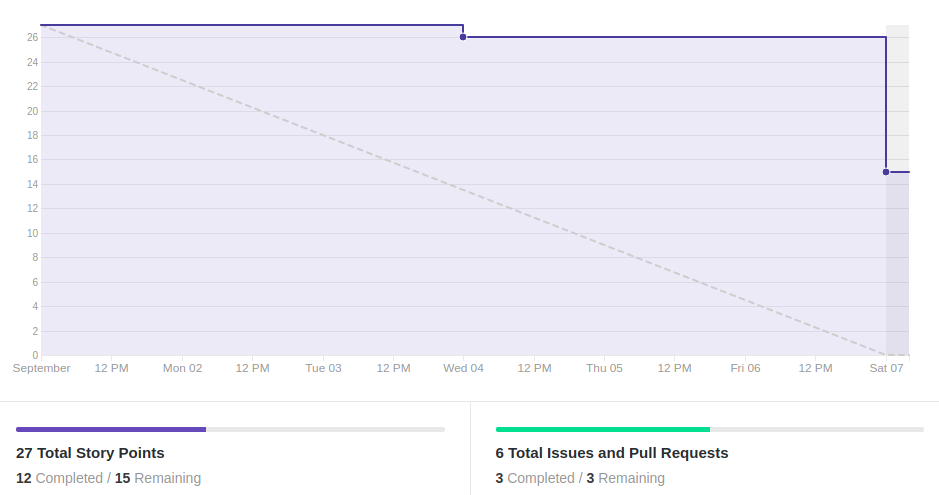
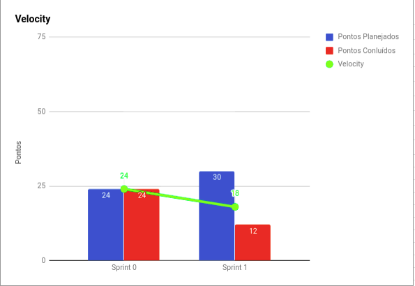

# Resultados 

## 1. Indicadores de Produtividade da Equipe

### 1.1 Fechamento da Sprint 

**Pontos planejados: 30 pontos**
 
**Pontos concluídos: 12 pontos**
 
**Dívida para a próxima Sprint: 15 pontos**
 
**Pontos Cancelados: 3 pontos**

| Atividade | Situação |
| --------  | :----:   |
|[D01 - Fazer Documento de Visão](https://github.com/fga-eps-mds/2019.2-Grupo2/issues/10)| Dívida Técnica | 
|[D02 - Fazer Estrutura analítica de projetos](https://github.com/fga-eps-mds/2019.2-Grupo2/issues/8)| Dívida Técnica | 
|[D03 - Fazer Termo de abertura de projetos](https://github.com/fga-eps-mds/2019.2-Grupo2/issues/7)| Dívida Técnica | 
|[D05 - Fazer Protótipo de Baixa Fidelidade](https://github.com/fga-eps-mds/2019.2-Grupo2/issues/12)| Cancelada | 
|[D04 - Fazer Documento de Arquitetura](https://github.com/fga-eps-mds/2019.2-Grupo2/issues/11)| Concluída | 
|[S11 - Conceitos Financeiros](https://github.com/fga-eps-mds/2019.2-Grupo2/issues/16)| Concluída | 
| [D06 - Criar template de issue](https://github.com/fga-eps-mds/2019.2-Grupo2/issues/17) | Concluída |

## 1.2 Burndown

## 1.3 Velocity

## 1.4 Retrospectiva 
| Membro | Pontos Positivos | Pontos Negativos | Sugestão de Melhoria | Pontuação das Histórias |
| --------  | :----:   | :----:   | :----:   | :----:   |
| Adrianne | Finalização do escopo do projeto, melhoria da comunicação | Projeto atrasado, não conseguir o treinamento sobre meios de pagamento, muitas dívidas | Organização da equipe de MDS, melhorar a comunicação | Não se aplica |
| Andrew | Percepção que não precisa esperar o cliente, determinar o escopo do projeto | Demorou a percepção de que não precisa do cliente, planejamento errado | Planejar melhor e melhorar a comunicação | Não se aplica |
| Maria Luiza | Determinar o escopo do projeto, ambientação ao ritmo da disciplina | Atraso do projeto por conta da dependência do cliente e falha na comunicação | Melhorar comunicação e planejar melhor as atividades | Não se aplica |
| Natália | Percepção da não dependência do cliente, MDS está disposto a trabalhar | Demora da percepção da dependência do cliente e falha na comunicação | Melhorar a comunição e garantir o entendimento das atividades por parte de MDS | Não se aplica |
| Isabella | Cumprimento da divisão da tarefa e  melhora na comunicação | Desconhecimento do escopo do projeto | Planejar melhor e determinar os prazos |Não se aplica |
| Luiza | Percepção da independência do projeto e a equipe de MDS começou a trabalhar | Falta de definição completa do escopo, muitas dúvidas por parte do escopo | Definição mais clara do escopo e melhor divisão das tarefas | Não se aplica |
| Gabriel | Melhora da comunicação, divisão do documento de arquitetura | Indefinição do escopo, dificultando a execução das atividades | Melhorar a comunicação e definição de atividades | Não se aplica |
| Erick | - | - | - | - |
| João Gabriel | Organização das tarefas e definição do escopo | Confusão em relação ao escopo e a realização das atividades | Agilizar na distribuição das atividades | Não se aplica |
| João Paulo | Divisão das atribuições e a definição do escopo | Não entendimento das atividades e falha na comunicação | Melhora da comunicação entre MDS e EPS e definir melhor as atividades | Não se aplica |

## 1.6 Quadro de conhecimento

# 2. Visão do Tech Leader

Foi planejado para essa sprint 30 pontos e só foi concluído 12 pontos, evidenciado no Velocity. Isso serviu de bastante aprendizado para a equipe, visto que várias das atividades planejadas não foram concluídas, o que resultou em métricas críticas para o projeto. Esse fato ocorreu devido a instabilidade e a falta de entendimento do projeto por parte da equipe.

A história [D05 - Fazer Protótipo de Baixa Fidelidade](https://github.com/fga-eps-mds/2019.2-Grupo2/issues/12) foi cancelada, devido a não necessidade de protótipo de baixa fidelidade, visto que a ideia e as telas do cliente já estavam bem consolidadas. O que resultou na decisão de cancelar essa tarefa.	

A reunião com o cliente ocorreu no meio da sprint, o que dificultou a iniciação das tarefas tanto por parte da equipe de MDS, quanto da equipe de EPS. Este fato resultou no Burndown, onde a equipe só conseguiu realizar as tarefas no último dia. 

Outro ponto crítico indicado pelos membros da equipe foi a comunicação dentro da equipe. Visto que não estava havendo muita interação entre os membros de EPS e MDS. 

As práticas ágeis foram aplicadas, com reuniões diárias via Telegram e reuniões semanais de planejamento ocorrida no início da sprint. Além das reuniões de retrospectiva e revisão ocorridas no final da sprint. Essas reuniões ocorrem todos os sábados presencialmente. 
