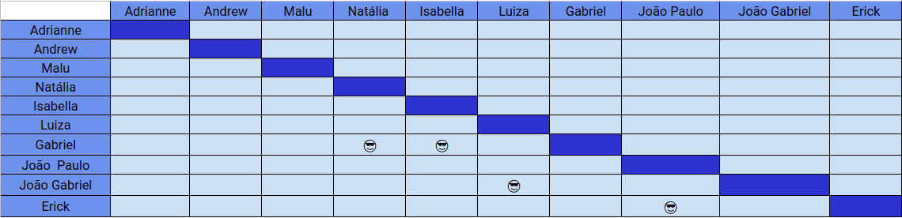

# Planejamento SPRINT 10

**Data de início**: 03/11/2019  
**Data de fim**: 09/11/2019  
**Duração**: 7 dias  
**Pontuação**: 30 pontos 

## 1. Objetivo

Fazer funcionalidades priorizadas pela product owner em conjunto com o a scrum master. **A pontuação utilizada será baseada na escala Fibonacci ( 1, 2, 3, 5, 8, 13)**

## 2. Papéis 

* **Scrum Master:** Maria Luiza
* **Product Owner:** Adrianne Alves
* **Devops:** Andrew Lucas
* **Architect:** Natália Maria

## 3. Backlog da Sprint 3

### Overview
| Atividade | Pontuação | Responsável | Dívida |
| -------- | :----: | :----: | :----: |
|[US23 - Listar Dívidas - Design](https://github.com/fga-eps-mds/2019.2-Over26/issues/150) | 2 |João Gabriel e Luiza  | Não |
|[US23 - Listar dívidas - Integração](https://github.com/fga-eps-mds/2019.2-Over26/issues/151) | 5 |João Gabriel e Luiza  | Não |
|[US23 - Listar dívidas - Backend](https://github.com/fga-eps-mds/2019.2-Over26/issues/152) | 2 | João Paulo e Erick  | Não |
|[TS10 - Testes de Aceitação do Frontend](https://github.com/fga-eps-mds/2019.2-Over26/issues/153) | 5 |Gabriel e Natália   | Não |
|[TS11 - Bugs transactions](https://github.com/fga-eps-mds/2019.2-over26/issues/158) | 3 | Natália e Isabella  |Não  |
|[TS12 - Bug Cancelar Overdraft](https://github.com/fga-eps-mds/2019.2-over26/issues/156) | 3 | João Paulo e Erick  |Não  |
|[TS13 - Melhoria tela inicial](https://github.com/fga-eps-mds/2019.2-over26/issues/163) | 3 | Gabriel e Isabella  | Não  |
|[US08 - Acompanhar período de insenção de juros - Integração](https://github.com/fga-eps-mds/2019.2-Over26/issues/127) | 3 | Luiza e Gabriel  | Sim |
|[US08 - Acompanhar período de insenção de juros - Backend](https://github.com/fga-eps-mds/2019.2-Over26/issues/128) | 3 | Luiza e Gabriel  | Sim |
|[Consertar controller checkAmount - Back](https://github.com/fga-eps-mds/2019.2-Over26/issues/161) | 3 | Luiza e Gabriel  | Sim |

## 4. Pareamento
