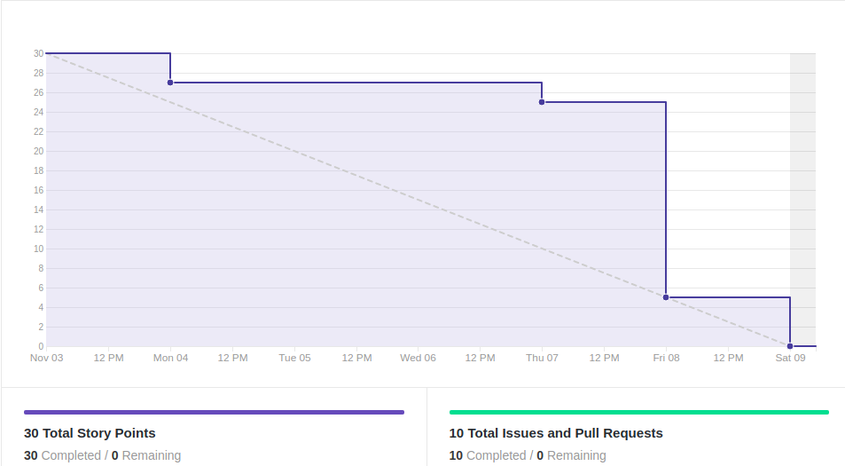
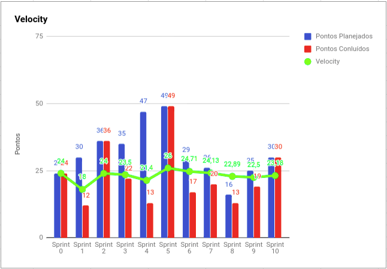
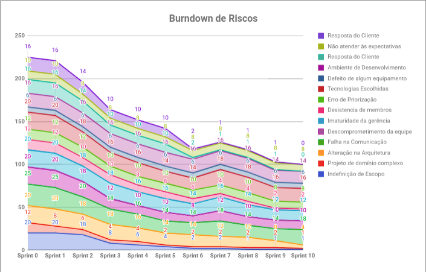
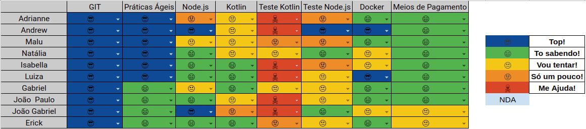

# Resultados 

## 1. Indicadores de Produtividade da Equipe

### 1.1 Fechamento da Sprint 

**Pontos concluídos: 30 pontos**

| Atividade | Situação |
| --------  | :----:   |
| [US23 - Listar Dívidas - Design](https://github.com/fga-eps-mds/2019.2-Over26/issues/150) | Concluída | 
| [US23 - Listar dívidas - Integração](https://github.com/fga-eps-mds/2019.2-Over26/issues/151) | Concluída | 
| [US23 - Listar dívidas - Backend](https://github.com/fga-eps-mds/2019.2-Over26/issues/152) | Concluída | 
| [TS10 - Testes de Aceitação do Frontend](https://github.com/fga-eps-mds/2019.2-Over26/issues/153) | Concluída | 
| [TS11 - Bugs transactions](https://github.com/fga-eps-mds/2019.2-over26/issues/158) | Concluída | 
| [TS12 - Bug Cancelar Overdraft](https://github.com/fga-eps-mds/2019.2-over26/issues/156) | Concluída | 
| [TS13 - Melhoria tela inicial](https://github.com/fga-eps-mds/2019.2-over26/issues/163) | Concluída | 
| [US08 - Acompanhar período de insenção de juros - Integração](https://github.com/fga-eps-mds/2019.2-Over26/issues/127) | Concluída | 
| [US08 - Acompanhar período de insenção de juros - Backend](https://github.com/fga-eps-mds/2019.2-Over26/issues/128) | Concluída | 
|[Consertar controller checkAmount - Back](https://github.com/fga-eps-mds/2019.2-Over26/issues/161)|Concluída|

## EPS

| Atividade | Situação |
| -------- | :----: |
| Deploy do Backend | Concluída |
| Testes Frontend | Concluída |
| Qualidade de Código | Concluída |
| Documentar Sprint 9 | Concluída |

## 1.2 Burndown

## 1.3 Velocity 

## 1.4 Burndown de Riscos 

## 1.5 Retrospectiva
| Membro | Pontos Positivos | Pontos Negativos | Sugestão de Melhoria | Pontuação das Histórias |
| --------  | :----:   | :----:   | :----:   | :----:   |
| Adrianne | Histórias sendo entregues mais cedo, revisão dos pr's mais distribuídas e rápida, MDS já bastante independente | Membros com problemas externos, baixo desempenho pessoal no projeto devido problemas de saúde/pessoais, comunicação muito ruim | Melhorar comunicação, tentar fazer acompanhamento individual com alguns membros | OK | 
| Andrew | Melhora no burndown, maior velocidade na revisão de pr | Muitos imprevistos, e problemas pessoais de membros do grupo, falhas de comunicação | melhorar a comunicação, para que todos estajam cientes do que está acontecendo | Bom | 
| Maria Luiza |Essa sprint foi bem produtiva com entregas ao longo da sprint, nenhuma dívida técnica, issues menores | Pareamentos não funcionaram muito bem, comunicação durante a sprint ruim, melhorou só no final, Gabriel sem internet | Melhorar a comunicação durante a sprint, com o andamento das histórias, melhorar a velocidade de análise do PR, alinhar andamento do projeto com toda a equipe| OK | 
| Natália | Consegui fechar minhas histórias com o Gabriel e com a Isabella, o time todo está se empenhando. | Algumas notícias ruins e final do semestre. | Nenhuma. | Ok  | 
| Isabella | - | - | - | - | 
| Luiza |Consegui finalizar todas as Issues que tinham ficado de dívida e conseguimos fazer o design da tela de parcelas |Acabei ficando um pouco sobrecarregda por causa das dividas e da história da sprint que era complicada, achei que nâo ia dar tempo e quase entrei em desespero  | Dividir melhor e histórias menores   |A pontuação da Issue us08 foi apenas de 3, mas não tinha mexido com teste e tive bastante dificuldade então a pontuação pra mim foi maior. | 
| Gabriel | Todas as histórias planejadas foram concluídas. | Fiquei sem internet quase a semana toda, e por isso só pude trabalhar no fim da spint. |  | Ok. | 
| Erick | Todas as histórias foram finalizadas. | Divisão de histórias e pontuação não foram boas. | Melhorar comunicação e análise de PR mais rápida. | Ruim, algumas histórias foram mais simples e outras deram muito mais trabalho do que o esperado. | 
| João Gabriel | Todas as historias foram finalizadas. | Comunicação PESSIMA. | Comunicar quando for trabalhar em uma issue,especialmente quando não estiver a principio no pareamento.  | OK | 
| João Paulo | - | - | - | - | 

## 1.6 Quadro de conhecimento

# 2. Visão do Tech Leader
Essa sprint foi bem produtiva, o que é possível observar no burndown e velocity. Visto que não teve nenhuma dívida técnica e entregas contínuas ao longo da sprint. Além de conseguirmos fazer issues menores para que a entrega fosse mais fluída. A equipe de MDS se dedicou bastante para conseguir entregar todas as issues a tempo. Algo positivo é a constância do velocity que a equipe está conseguindo seguir. 

Tudo isso tem mostrado que a equipe tem conseguido alcançar uma boa produtividade, a fim de realizar boas entregas. Porém, a comunicação foi um gargalo novamente nessa sprint, pois alguns membros sabiam fazer as tarefas e acabaram se antecipando, deixando outros membros meio perdidos no que estava acontecendo no código, o que demonstrou falhas no pareamento. Outro gargalo são as ausências de membros da equipe tanto nas reuniões presenciais, quanto nas DAILIES no Telegram.

O fator mais crítico da sprint foi a quase desistência de um dos membros de MDS (trancamento do semestre), o que desestabilizou um pouco a equipe de EPS, já que o risco de desistência estava diminuindo conforme se aproxima o fim do semestre. Porém o membro disse que mesmo trancando o semestre, iria até o final com o projeto. Além do Android Studio estar dificultando o desenvolvimento e análise de PRs, o que tem dificultado a velocidade de análise dos mesmos. 

As práticas ágeis foram aplicadas, com reuniões diárias via Telegram (porém, nem todos os membros estão levando a sério a DAILY, mesmo insistindo) e reuniões semanais de planejamento ocorrida no início da sprint. Além das reuniões de retrospectiva e revisão ocorridas no final da sprint. Essas reuniões ocorrem todos os sábados presencialmente.