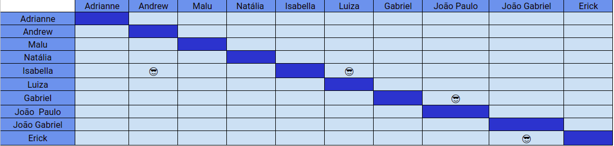

# Planejamento SPRINT 11

**Data de início**: 10/11/2019  
**Data de fim**: 16/11/2019  
**Duração**: 7 dias  
**Pontuação**: 29 pontos 

## 1. Objetivo

Fazer funcionalidades priorizadas pela product owner em conjunto com o a scrum master. **A pontuação utilizada será baseada na escala Fibonacci ( 1, 2, 3, 5, 8, 13)**

## 2. Papéis 

* **Scrum Master:** Maria Luiza
* **Product Owner:** Adrianne Alves
* **Devops:** Andrew Lucas
* **Architect:** Natália Maria

## 3. Backlog da Sprint 3

### Overview
| Atividade | Pontuação | Responsável | Dívida |
| -------- | :----: | :----: | :----: |  
| [TS11 - Mostrar valor da nova dívida quando for parcelar](https://github.com/fga-eps-mds/2019.2-over26/issues/169)| 3 | Isabela, Luiza e Andrew | Não |
| [TS12 - Restringir a funcionalidade de checar eligibilidade](https://github.com/fga-eps-mds/2019.2-over26/issues/170) | 1 | Isabela, Luiza e Andrew | Não |
| [TS13 - Implementação do suporte a multiusuário](https://github.com/fga-eps-mds/2019.2-Over26/issues/171) | 13 | Erick e João Gabriel | Não |
| [US22 - Pagar Parcelas - Design](https://github.com/fga-eps-mds/2019.2-Over26/issues/155)| 3 | Gabriel e João Paulo | Não |
| [US22 - Pagar parcela - Integração](https://github.com/fga-eps-mds/2019.2-Over26/issues/149)| 5 | Gabriel e João Paulo | Não |
| [Arrumar mecanismo de pagar parcela - Back](https://github.com/fga-eps-mds/2019.2-Over26/issues/172)| 2 | Isabela, Luiza e Andrew | Não |
|[TS13 - Implementação do suporte a multiusuário- Back](https://github.com/fga-eps-mds/2019.2-Over26/issues/184)| 2 |Erick e João Gabriel | Não |

## 4. Pareamento
