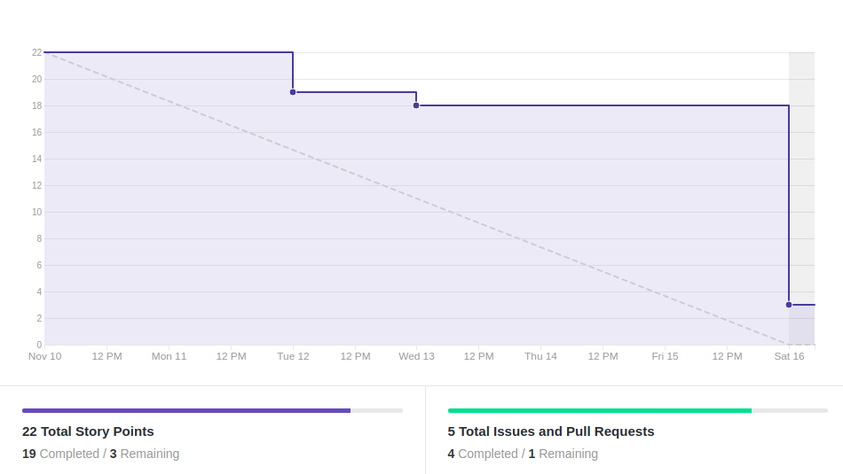
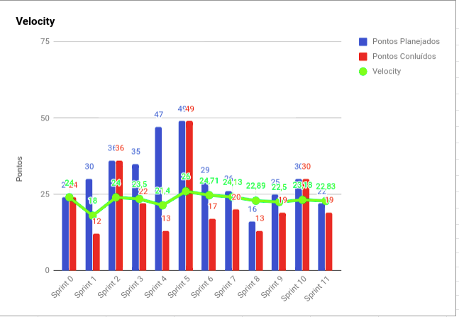
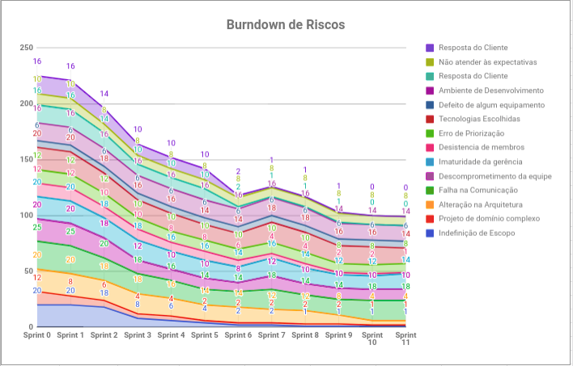
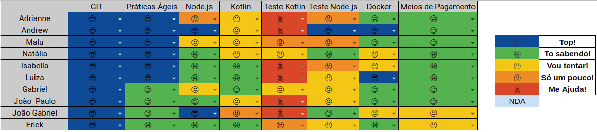

# Resultados 

## 1. Indicadores de Produtividade da Equipe

### 1.1 Fechamento da Sprint 

**Pontos concluídos: 22 pontos**
 
**Pontos cancelados: 7 pontos**
 

| Atividade | Situação |
| --------  | :----:   |
| [TS11 - Mostrar valor da nova dívida quando for parcelar](https://github.com/fga-eps-mds/2019.2-over26/issues/169) | Concluída | 
| [TS12 - Restringir a funcionalidade de checar eligibilidade](https://github.com/fga-eps-mds/2019.2-over26/issues/170) | Concluída | 
|  [TS13 - Implementação do suporte a multiusuário](https://github.com/fga-eps-mds/2019.2-Over26/issues/171) | Concluída | 
| [US22 - Pagar Parcelas - Design](https://github.com/fga-eps-mds/2019.2-Over26/issues/155) | Concluída | 
| [US22 - Pagar parcela - Integração](https://github.com/fga-eps-mds/2019.2-Over26/issues/149) | Cancelada | 
| [Arrumar mecanismo de pagar parcela - Back](https://github.com/fga-eps-mds/2019.2-Over26/issues/172) | Cancelada | 
| [TS13 - Implementação do suporte a multiusuário- Back](https://github.com/fga-eps-mds/2019.2-Over26/issues/184) | Concluída | 

## 1.2 Burndown

## 1.3 Velocity 

## 1.4 Burndown de Riscos 

## 1.5 Retrospectiva
| Membro | Pontos Positivos | Pontos Negativos | Sugestão de Melhoria | Pontuação das Histórias |
| --------  | :----:   | :----:   | :----:   | :----:   |
| Adrianne | Constância no desenvolvimento das histórias | Problema com o ambiente | Melhorar a comunicação | Ok | 
| Andrew | O grupo até que desenrolou bem, mesmo sem 3 eps  | Tentei fazer tudo da sprint em 3 dias, mas não consegui finalizar e mds não conseguiu finalizar a história sem auxilio | comunicação  |  OK
| Maria Luiza | Evolução boa de MDS. A parte de deploy foi feita nessa sprint, o que facilita o teste das funcionalidades | Falha na comunicação, o feriado atrapalhou, pois fiquei sem comunicação nenhuma, dívidas técnicas | Melhorar a comunicação e dívidas técnicas, além de agilizar a análise dos PRs | OK | 
| Natália | A evolução de MDS foi percepível, e a parte do CI/CD foi desenrolada, já estamos com app na Play Store. A história do monousuário foi concluída. | As dívidas e a comunicação. | Melhorar a comunicação e tentar planejar menos atividades. | Ok | 
| Isabella | As historias estavam bem divididas e menores | Tive problemas pessoais e teve dividas | Melhorar comunicacao| Ok |
| Luiza |As histórias foram menores e mais bem divididas | Dificuldade com teste unitário e muita carga de outras matérias | Melhorar a comunicação | Ok | 
| Gabriel | Semestre acabando. | História complexa. | Comunicação. | Ok. |
| Erick | História completada e projeto finalizando. | Comunicação. | Comunicação. | Algumas atividades não foram condizentes com a pontuação. | 
| João Gabriel | | Melhorar counicação do grupo em si. | Reportar as dificuldades no grupo antes da vesperas.  | Alta. | 
| João Paulo | Acabando | Problemas estranhos na história | Comunicação | Ok. |

## 1.6 Quadro de conhecimento

# 2. Visão do Tech Leader
Essa sprint foi um pouco atípica, pois teve um feriado, onde várias pessoas de EPS estariam viajando (viagens marcadas há um tempo), o que acabou prejudicando um pouco o andamento do projeto. Apesar disso, a equipe tem se mostrado bastante auto-gerenciável. Pois todas as tarefas foram concluídas e a equipe conseguiu se planejar mesmo com a ausência da maioria de EPS. 

O velocity se manteve constante, o que mostra uma boa produtividade da equipe. Porém a comunicação tem se mostrado um grande gargalo na equipe, ainda mais com as viagens dos membros. 

As práticas ágeis foram aplicadas, com reuniões diárias via Telegram (porém, nem todos os membros estão levando a sério a DAILY, mesmo insistindo) e reuniões semanais de planejamento ocorrida no início da sprint. Além das reuniões de retrospectiva e revisão ocorridas no final da sprint. Essas reuniões ocorrem todos os sábados presencialmente. A reunião presencial ocorreu, mesmo com somente um membro de EPS.

