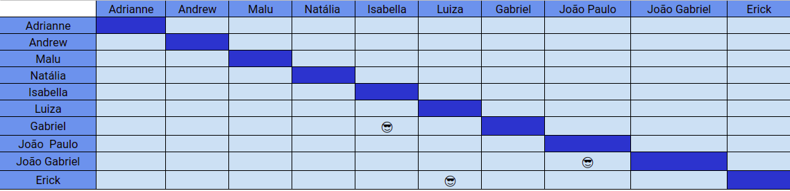

# Planejamento SPRINT 12

**Data de início**: 17/11/2019  
**Data de fim**: 23/11/2019  
**Duração**: 7 dias  
**Pontuação**: 29 pontos 

## 1. Objetivo

Fazer funcionalidades priorizadas pela product owner em conjunto com o a scrum master. **A pontuação utilizada será baseada na escala Fibonacci ( 1, 2, 3, 5, 8, 13)**

## 2. Papéis 

* **Scrum Master:** Maria Luiza
* **Product Owner:** Adrianne Alves
* **Devops:** Andrew Lucas
* **Architect:** Natália Maria

## 3. Backlog da Sprint 3

### Overview
| Atividade | Pontuação | Responsável | Dívida |
| - | - | - | - |
| [TS14 - Restringir a função de cancelar Overdraft](https://github.com/fga-eps-mds/2019.2-over26/issues/191) | 1| Erick e Luiza | Não |
| [Traduzir e refatorar os textos apresentados no app](https://github.com/fga-eps-mds/2019.2-over26/issues/190) | 3 | Erick e Luiza | Não |
| [Restringir caracteres das operações de entrada e saída de recursos](https://github.com/fga-eps-mds/2019.2-over26/issues/189)| 2 | Erick | Não |
| [TS15 - Melhorar telas de Cash-In e Cash-Out](https://github.com/fga-eps-mds/2019.2-over26/issues/192) | 2 | Erick e Luiza | Não |
| [Adicionar tela de descrição da funcionalidade "Atualizar Data"](https://github.com/fga-eps-mds/2019.2-over26/issues/193) | 3 | João Gabriel e João Paulo | Não |
| [Modificar ícones, fontes e espaçamentos](https://github.com/fga-eps-mds/2019.2-over26/issues/187) | 8 | Gabriel e Isabella | Não |
| [Remover "Consultar Dívida"](https://github.com/fga-eps-mds/2019.2-over26/issues/185) | 2 | João Gabriel e João Paulo | Não |
| [Parcelamento sem definir data de vencimento](https://github.com/fga-eps-mds/2019.2-over26/issues/204) | 2 | Erick | Não |
| [Consertar tela de parcelamento](https://github.com/fga-eps-mds/2019.2-over26/issues/195) | 2 | Erick | Não |
| [Colocar botão em torno de parcelar dívida e cancelar overdraft](https://github.com/fga-eps-mds/2019.2-over26/issues/186) | 2 | Gabriel e Isabella | Não |
| [Aumentar a cobertura de testes - Backend](https://github.com/fga-eps-mds/2019.2-over26/issues/199) | 3 | Natália | Não |

## 4. Pareamento
