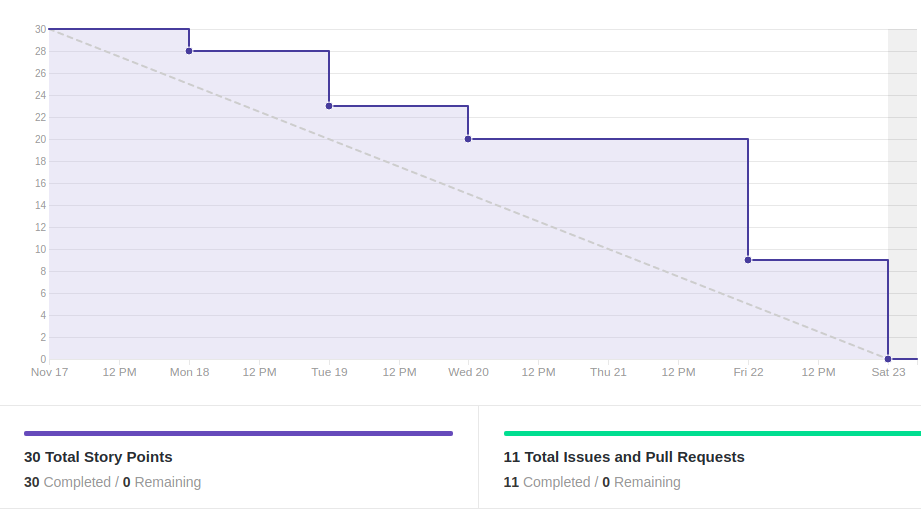
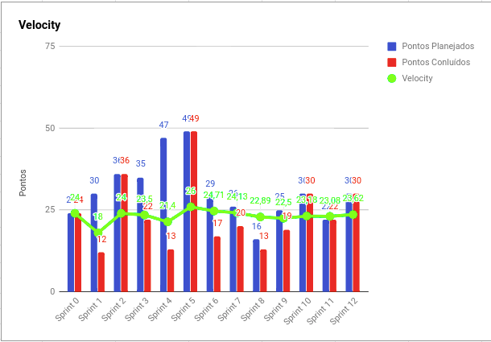
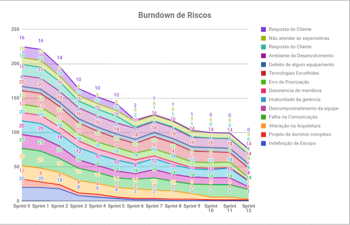
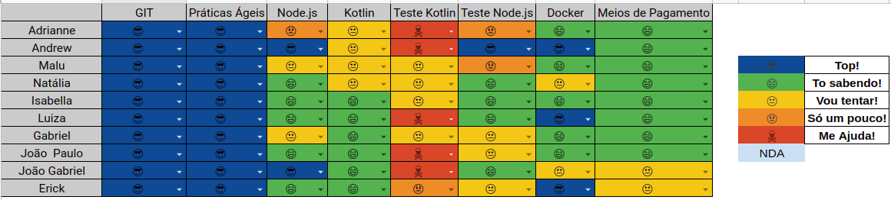

# Resultados 

## 1. Indicadores de Produtividade da Equipe

### 1.1 Fechamento da Sprint 

**Pontos concluídos: 30 pontos**
 

| Atividade | Situação |
| --------  | :----:   |
| [TS14 - Restringir a função de cancelar Overdraft](https://github.com/fga-eps-mds/2019.2-over26/issues/191) | Concluída | 
| [Traduzir e refatorar os textos apresentados no app](https://github.com/fga-eps-mds/2019.2-over26/issues/190) | Concluída |
| [Restringir caracteres das operações de entrada e saída de recursos](https://github.com/fga-eps-mds/2019.2-over26/issues/189) | Concluída | 
| [TS15 - Melhorar telas de Cash-In e Cash-Out](https://github.com/fga-eps-mds/2019.2-over26/issues/192) | Concluída | 
| [Adicionar tela de descrição da funcionalidade "Atualizar Data"](https://github.com/fga-eps-mds/2019.2-over26/issues/193) | Concluída | 
| [Modificar ícones, fontes e espaçamentos](https://github.com/fga-eps-mds/2019.2-over26/issues/187) | Concluída | 
| [Remover "Consultar Dívida"](https://github.com/fga-eps-mds/2019.2-over26/issues/185)  | Concluída | 
| [Parcelamento sem definir data de vencimento](https://github.com/fga-eps-mds/2019.2-over26/issues/204) | Concluída | 
| [Consertar tela de parcelamento](https://github.com/fga-eps-mds/2019.2-over26/issues/195) | Concluída | 
| [Colocar botão em torno de parcelar dívida e cancelar overdraft](https://github.com/fga-eps-mds/2019.2-over26/issues/186) | Concluída | 
| [Aumentar a cobertura de testes - Backend](https://github.com/fga-eps-mds/2019.2-over26/issues/199) | Concluída | 

## 1.2 Burndown

## 1.3 Velocity 

## 1.4 Burndown de Riscos 

## 1.5 Retrospectiva
Fizemos uma retrospectiva diferente, onde toda a equipe teve a oportunidade de falar na reunião pontos positivos e negativos de todo o projeto.

| Membro | Pontos Positivos | Pontos Negativos | Sugestão de Melhoria |
| --------  | :----:   | :----:   | :----:  |
| Adrianne | Equipe de MDS conseguiu se tornar independente para aprendizado. EPS evoluiu bastante na velocidade da tomada de decisões. Os riscos foram mitigados ao longo do projeto. O fluxo principal foi entregue apesar dos contrapontos.  | Comunicação ruim. Mudança total de escopo praticamente por sprint. Escolha ruim de tecnologia por parte de EPS prejudicou evolução da equipe. Problemas com android Studio. Membros muito atarefados de maneira geral e com pouco tempo disponível. Decisão de aceite de histórias com qualidade não tão boa. Demora para disponibilização do app. Lançamento de única release. MDS respondendo dailies genericamente. EPS nem sempre respondendo dailies. Difícil gerenciar escopo e manter as decisões dinâmicas claras o suficiente para todos os membros.  | Melhorar compromisso com as dailies, realizar algum plano de gerenciamento de escopo, escolher melhor a tecnologia e as ferramentas. Em hipótese nenhuma aceitar história com qualidade inferior ao almejado, tanto em questão de código quanto de visual. Gerar releases semanais e rodar ciclos de feedback nesse mesmo rítmo, independente do nível em que o APP se encontra. |
| Andrew |MDS amadureceu bastante nas tecnologias. EPS amadureceu em questão nas tomadas de decisão do projeto e assumir as responsabilidades com as escolhas. Planejamento das histórias e dos pareamentos. | Centralização do desenvolvimento do Backend em mim, o que dificultou as minhas atividades de DEVOPS. Fiquei muito tempo buscando o deploy perfeito, o que demorou bastante para aplicar as atividades. O que atrasou bastante a qualidade do código, testes e etc. EPS tomou decisões erradas. Difícil ser EPS. Problema de comunicação e das DAILIES. | Comunicação e avaliar melhor a tecnologia. |
| Maria Luiza | A equipe amadureceu bastante. A equipe conseguiu ser reativa aos problemas, mitigando bem os problemas que foram surgindo. Melhora no planjemaneto daa issues. COnseguimos desenvolver um produto mesmo com os problemas técnicos| Respostas genéricas nas dailies, problema de comunicação, semestre corrido. Equipe cansada no final do semestre prejudicou o semestre. Decisões erradas de técnologia. | Comunicação no github, poderiamos ter usado mais as ferramentas do github e tambpem definir melhor os requisitos, e mostrar mostrar o roadmap para mds. Melhorar comunicação em falar quando tem algum problema.  | 
| Natália | -  | -  | - |
| Isabella | Quantidade de coisas novas que a gente aprendeu, ajuda a ver o que queremos trabalhar no futuro. Pareamentos e distribuir conhecimento. | Comunicação foi o ponto que mais pecamos nesse projeto, demorar a pedir ajuda e quando tinha um problema | Aprender a dizer quando precisa de ajuda | 
| Luiza | Produção de um aplicativo, pois não tinha conhecimento de Back e Front. Muito aprendizado de software em geral. Trabalhar com a metodologia. Gostei do suporte de EPS. | No início estávamos perdidos no contexto do projeto, o que demorou bastante oara entrar no ritmo. Foi difícil me adaptar na metodologia da matéria. Aprendi mais sobre o github. Falta de tempo para entender mais as coisas.| Comunicação e definição dos requisitos. |
| Gabriel | Amadurecimento geral com projetos reais, independente para pesquisar as coisas e aprendizado | Falta de comunicação durante o semestre, definição clara de escopo | Melhorar a comunicação e ambiente de desenvolvimento (Android Studio prejudicou bastante)|
| Erick | Trabalho em equipe, ver como funciona na prática e no mercado de trabalho. Foi legal ter que trabalhar com pareamentos com pessoas diferentes e transmitir conhecimento. Aprendizado de diversas tecnologias, arquitetura (Cliente e Servidor) e a metodologia.  | O não conhecimento na arquitetura do front, pois atrapalhou bastante o avanço do projeto. A questão do ROADMAP e entender os requisitos. Utilizar mais as ferramentas do github.| Comunicar mais pelo github. Mais treinamentos sobre arquitetura e tecnologia. Comnunicação e alinhamento das coisas que precisamos fazer. |
| João Gabriel | Aprender na prática com objetivo. Interessante trabalhar com a metodologia ágil. | Comunicação e desencontros de horários para parear. Adroid Studio atrapalhou bastante. | Mais atenção na comunicação de como está o andamento do projeto|
| João Paulo | Aprendizado sobre a realidade de um projeto. Os pareamentos foram importantes para discutir soluções. Ajuda do Andrew no Backend. | O Android Studio prejudicou bastante o andamento do projeto. Escolha do Kotlin. Problema de comunicação e de horário. | Mais treinamentos sobre a tecnologia no início do projeto. |

## 1.6 Quadro de conhecimento

# 2. Visão do Tech Leader
Essa sprint foi importante para finalizar tarefas importantes para a finalização do projeto, pois foi a penúltima sprint. A equipe de MDS tem amadurecido bastante nas tecnologias, mostrando um avanço nas tecnologias principais. Como pode-se observar no quadro de conhecimento o teste do Front foi o único que não conseguimos distribuir o conhecimento para toda a equipe, pois foi feito muito pouco. Porém, o restante do conhecimento têm mostrado bastante avanço. 

A comunicação da equipe foi o maior gargalo de todo o projeto, pois muitas pessoas esperavam muito para pedir ajuda e as DAILIES não foram eficientes para que MDS entendesse que tinham que falar todas as dificuldades das suas demandas e não falar de forma geral. 

Foi entregue todas as demandas e foi feita durante toda a sprint, como pode-se ver no burndown e velocity. O que mostra uma evolução na produtividade da equipe em geral. Temos conseguido eliminar melhor os impedimentos para qye eles executem as tarefas de forma mais fluída.

As práticas ágeis foram aplicadas, com reuniões diárias via Telegram (porém, nem todos os membros estão levando a sério a DAILY, mesmo insistindo) e reuniões semanais de planejamento ocorrida no início da sprint. Além das reuniões de retrospectiva e revisão ocorridas no final da sprint. Essas reuniões ocorrem todos os sábados presencialmente.

