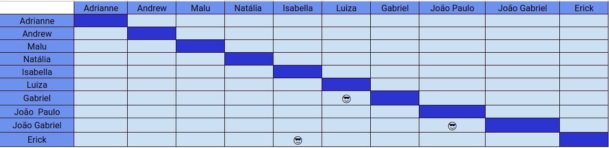

# Planejamento SPRINT 13

**Data de início**: 24/11/2019  
**Data de fim**: 27/11/2019  
**Duração**: 4 dias  
**Pontuação**: 21 pontos 

## 1. Objetivo

Fazer funcionalidades priorizadas pela product owner em conjunto com o a scrum master. **A pontuação utilizada será baseada na escala Fibonacci ( 1, 2, 3, 5, 8, 13)**

## 2. Papéis 

* **Scrum Master:** Maria Luiza
* **Product Owner:** Adrianne Alves
* **Devops:** Andrew Lucas
* **Architect:** Natália Maria

## 3. Backlog da Sprint 13

### Overview
| Atividade | Pontuação | Responsável | Dívida |
| - | - | - | - |
| [TS16 - Traduzir Cash In e Cash Out](https://github.com/fga-eps-mds/2019.2-Over26/issues/208)| 1 | Luiza e Gabriel | Não |
| [TS17 - Consultar dívida](https://github.com/fga-eps-mds/2019.2-Over26/issues/209) | 1 | João Gabriel e João Paulo |  |
| [Deixar o ambiente de produção funcionando](https://github.com/fga-eps-mds/2019.2-Over26/issues/217) | 5 | Andrew | Não |
| [Página principal congelada ao entrar em "Consultar Dívidas"](https://github.com/fga-eps-mds/2019.2-Over26/issues/217) | 3 | Gabriel e Luiza  | Não |
| [Atualizar saldo ao criar nova dívida](https://github.com/fga-eps-mds/2019.2-Over26/issues/188) | 3 | João Gabriel e João Paulo | Não |
| [Não é possível retirar um valor superior ao limite do cheque especial](https://github.com/fga-eps-mds/2019.2-Over26/issues/203) | 5 | Erick e Isabella | Não |
| [Fazer apresentação](https://github.com/fga-eps-mds/2019.2-Over26/issues/219) | 3 | Todos | Não |

## 4. Pareamento
