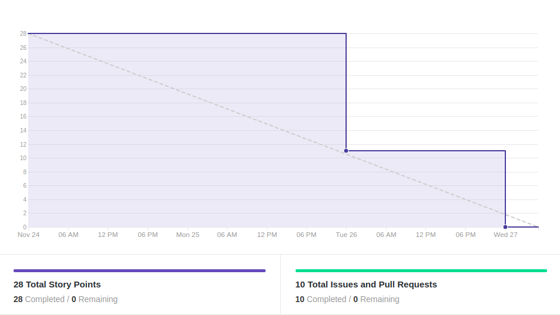
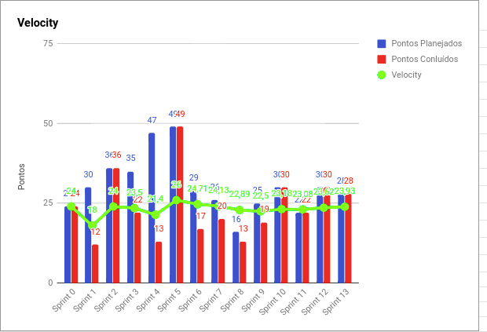
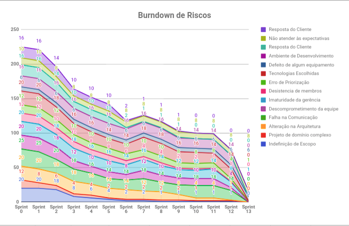
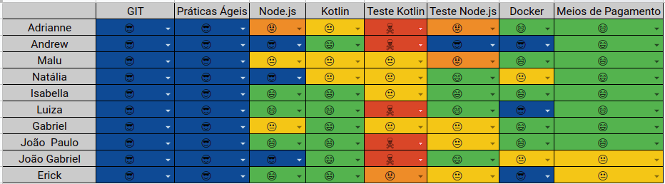

# Resultados 

## 1. Indicadores de Produtividade da Equipe

### 1.1 Fechamento da Sprint 

**Pontos concluídos: 28 pontos**
 

| Atividade | Situação |
| --------  | :----:   |
| [TS16 - Traduzir Cash In e Cash Out](https://github.com/fga-eps-mds/2019.2-Over26/issues/208) | Concluída | 
| [TS17 - Consultar dívida](https://github.com/fga-eps-mds/2019.2-Over26/issues/209) | Concluída  | 
| [Deixar o ambiente de produção funcionando](https://github.com/fga-eps-mds/2019.2-Over26/issues/217) | Concluída | 
| [Página principal congelada ao entrar em "Consultar Dívidas"](https://github.com/fga-eps-mds/2019.2-Over26/issues/217) | Concluída | 
| [Atualizar saldo ao criar nova dívida](https://github.com/fga-eps-mds/2019.2-Over26/issues/188) | Concluída | 
|  [TS18 - Salvar o limite com valor inferior ao valor utilizado](https://github.com/fga-eps-mds/2019.2-Over26/issues/203) | Concluída | 
| [Fazer apresentação](https://github.com/fga-eps-mds/2019.2-Over26/issues/219) | Concluída | 
| [Parcelar Dívida](https://github.com/fga-eps-mds/2019.2-Over26/issues/211) | Concluída | 
| [TS19 - Salvar o limite com valor inferior ao valor utilizado](https://github.com/fga-eps-mds/2019.2-Over26/issues/215) | Concluída |
| [TS20 - Melhorar UI do aplicativo ](https://github.com/fga-eps-mds/2019.2-Over26/issues/220) | Concluída |

## 1.2 Burndown

## 1.3 Velocity 

## 1.4 Burndown de Riscos 

## 1.5 Retrospectiva
[Post Mortem](/documentation/post-mortem.md)

## 1.6 Quadro de conhecimento

# 2. Visão do Tech Leader
Essa foi a nossa última sprint. A equipe evoluiu bastante desde o início e se mostrou bastante produtiva no final do projeto. Isso tudo evidencia que a equipe tem evoluído bastante para se tornar uma equipe autogerenciável. 

Esse projeto foi de grande aprendizado para todos tanto de tecnologia, metodologia, como em trabalho em equipe. Todos foram surpreendidos com o tanto de coisas novas que aprendemos nesse semestre com as matérias de MDS e de EPS. 

As métricas melhoraram bastante até aqui, com entregas ao longo da sprint, issues menores e mais modularizadas, poucas dívidas técnicas e além da diminuição dos riscos do projeto. 

As práticas ágeis foram aplicadas via Telegram e Hangouts para fazer os últimos alinhamentos para a entrega da Release 2. 
