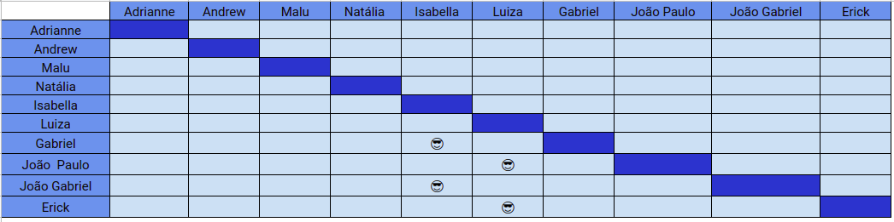

# Planejamento SPRINT 2

**Data de início**: 08/09/2019  
**Data de fim**: 14/09/2019  
**Duração**: 1 semana  
**Pontuação**: 36 pontos 

## 1. Objetivo

Fazer principais documentos que ficaram de dívida técnica da sprint passada e começar a desenvolver a aplicação com base nas histórias de usuário criadas pela Product Owner. **A pontuação utilizada será baseada na escala Fibonacci ( 1, 2, 3, 5, 8, 13)**

## 2. Papéis 

* **Scrum Master:** Maria Luiza
* **Product Owner:** Adrianne Alves
* **Devops:** Andrew Lucas
* **Architect:** Natália Maria

## 3. Backlog da Sprint 2

### Overview
| Atividade | Pontuação | Responsável | Dívida |
| -------- | :----: | :----: | :----: |
| [D01 - Fazer Documento de Visão](https://github.com/fga-eps-mds/2019.2-Grupo2/issues/10) | 5 | Isabella, Luiza, João Gabriel, Gabriel, João Paulo e Erick |Sim|
| [D02 - Fazer Estrutura analítica de projetos](https://github.com/fga-eps-mds/2019.2-Grupo2/issues/8) | 5 | Adrianne, Andrew, Maria Luiza, Natália |Sim|
| [D03 - Fazer Termo de abertura de projetos](https://github.com/fga-eps-mds/2019.2-Grupo2/issues/7) | 5 | Adrianne, Andrew, Maria Luiza, Natália |Sim|
| [D10 - Refatorar Documento de Arquitetura](https://github.com/fga-eps-mds/2019.2-Grupo2/issues/28) | 5 | Isabella, Luiza, João Gabriel, Gabriel, João Paulo e Erick |Sim|
| [US05 - Ativar crédito especial](https://github.com/fga-eps-mds/2019.2-Grupo2/issues/23) | 8 | Isabella, João Gabriel, Gabriel |Não|
| [US06 - Acompanhar limite de crédito](https://github.com/fga-eps-mds/2019.2-Grupo2/issues/24) | 5 | Luiza, Erick, João Paulo  |Não|
| [D11 - Delinear entidades do projeto](https://github.com/fga-eps-mds/2019.2-Grupo2/issues/29) | 3 | Natália e Adrianne  |Não|

## 4. Pareamento
