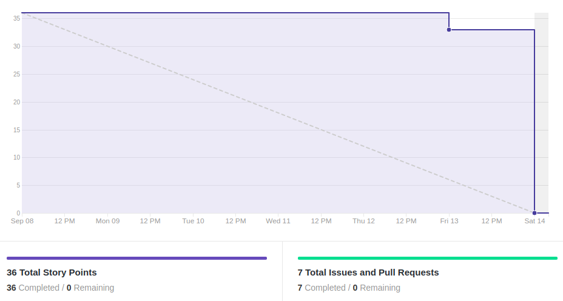
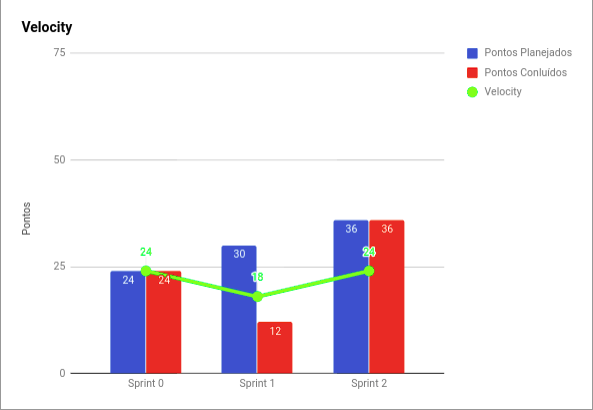
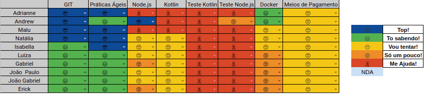

# Resultados 

## 1. Indicadores de Produtividade da Equipe

### 1.1 Fechamento da Sprint 

**Pontos planejados: 36 pontos**
 
**Pontos concluídos: 36 pontos**
 

| Atividade | Situação |
| --------  | :----:   |
| [D01 - Fazer Documento de Visão](https://github.com/fga-eps-mds/2019.2-Grupo2/issues/10) | Concluído | 
| [D02 - Fazer Estrutura analítica de projetos](https://github.com/fga-eps-mds/2019.2-Grupo2/issues/8) | Concluído | 
| [D03 - Fazer Termo de abertura de projetos](https://github.com/fga-eps-mds/2019.2-Grupo2/issues/7) | Concluído  |
| [D10 - Refatorar Documento de Arquitetura](https://github.com/fga-eps-mds/2019.2-Grupo2/issues/28) | Concluído |
| [US05 - Ativar crédito especial](https://github.com/fga-eps-mds/2019.2-Grupo2/issues/23) | Concluído |
| [US06 - Acompanhar limite de crédito](https://github.com/fga-eps-mds/2019.2-Grupo2/issues/24) | Concluído |
| [D11 - Delinear entidades do projeto](https://github.com/fga-eps-mds/2019.2-Grupo2/issues/29) | Concluído |

## 1.2 Burndown

## 1.3 Velocity   

## 1.4 Retrospectiva 
| Membro | Pontos Positivos | Pontos Negativos | Sugestão de Melhoria | Pontuação das Histórias |
| --------  | :----:   | :----:   | :----:   | :----:   |
| Adrianne | Adiantar documentação, escopo bem definido | Desespero, comunicação extremamente ruim, identificar problemas de gerenciamento da equipe de EPS | Tornar a reunião mais agradável, aumentar a motivação e desempenho, melhorar comunicação | OK |
| Andrew | Entregas de MDS, melhorando o entendimento do projeto e abrir mais diálogos para melhorar o projeto | Falta de compromisso nessa sprint e comunicação ruim | Melhorar a comunicação na hora da ajuda, dailys presenciais 2 vezes na semana | OK |
| Maria Luiza | Boas entregas de MDS e documentação de EPS | Falta de sinceridade nas dailys, comunicação ruim, deixar as tarefas para a última hora, comunicação entre EPS ruim, não ter pareamento | Sinceridade nas dailys e nos planejamentos e melhorar comunicação | OK |
| Natália | Feliz com MDS e EPS e organização pessoal | Procrastinação das tarefas, EPS está falhando no gerenciamento, semana estressante e o prazo curto | Melhorar a comunicação e falar com sinceridade, trabalhar em conjunto, fazer as coisas durante a sprint e não no final | Não (histórias de MDS) |
| Isabella | Conseguiu fazer a maior parte do planejado | Comunicação ruim e MDS teve dificuldade com as telas | Melhorar a motivação | OK |
| Luiza | Conseguiu entregar o planejado e pareamento | Dificuldade com o Android Studio, comunicação, organização pessoal não foi boa | Melhorar a comunicação e a organização pessoal | Não (8 pontos) |
| Gabriel | Entregas de MDS, evolução com o Android Studio e kotlin | Não teve pareamento, comunicação | Melhorar na comunicação e organização pessoal | Não (13 pontos) |
| Erick | Organização pessoal e conseguiu adiantar terça, tela funcionar, pareamento bom  | Comunicação e divisão de tarefas entre MDS, clareza nas atividades, novas tecnologias e falta de familiariedade | Melhorar a comunicação | Não (8 pontos) |
| João Gabriel | Conseguiu entregar as atividades planejadas | Organização pessoal ruim, dificuldade com o Android Studio, falta de pareamento, comunicação ruim | Orgnaizar melhor o pareamento e comunicação, deixar claro o que foi feito | Não (13 pontos) |
| João Paulo | Conseguiu entregar as atividades e pareamento bom | Organizar melhor o pareamento e as agendas, falta de comunicação, falta de organização pessoal | Melhorar a comunicação, organizar o pareamento no início da semana | Não (8 pontos) |

## 1.6 Quadro de conhecimento

# 2. Visão do Tech Leader
Foi planejado 36 pontos e todos eles foram concluídos. Essa sprint foi de bastante valia, onde a equipe conseguiu amadurecer mais o escopo, já que foi feita a documentação necessária para a iniciação do projeto, além da iniciação de código. Porém, a equipe continuou realizando as tarefas de forma tardia, como é evidenciado no Burndown, o que mostra que os membros não tiveram disponibilidade de realizar as suas tarefas ao longo da sprint, acumulando tudo para o final. 

Outro ponto crítico que persistiu entre a sprint passada e essa foi a falha na comunicação da equipe, prejudicando a realização das tarefas. Além da curva de aprendizagem alta de Kotlin, visto que foi o primeiro contato com o código dentro do projeto.

As práticas ágeis foram aplicadas, com reuniões diárias via Telegram e reuniões semanais de planejamento ocorrida no início da sprint. Além das reuniões de retrospectiva e revisão ocorridas no final da sprint. Essas reuniões ocorrem todos os sábados presencialmente. 