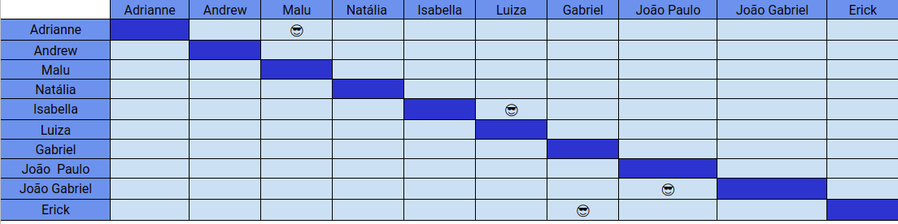

# Planejamento SPRINT 3

**Data de início**: 15/09/2019  
**Data de fim**: 21/09/2019  
**Duração**: 1 semana  
**Pontuação**: 35 pontos 

## 1. Objetivo

Fazer funcionalidades que agreguem valor ao projeto priorizadas pela Product Owner. **A pontuação utilizada será baseada na escala Fibonacci ( 1, 2, 3, 5, 8, 13)**

## 2. Papéis 

* **Scrum Master:** Maria Luiza
* **Product Owner:** Adrianne Alves
* **Devops:** Andrew Lucas
* **Architect:** Natália Maria

## 3. Backlog da Sprint 3

### Overview
| Atividade | Pontuação | Responsável | Dívida |
| -------- | :----: | :----: | :----: |
| [US04 - Checar Elegibilidade de Uso de Cheque Especial - Backend](https://github.com/fga-eps-mds/2019.2-Grupo2/issues/51) | 5 | João Paulo e João Gabriel | Não|
| [US06 - Acompanhar limite de crédito - BackEnd](https://github.com/fga-eps-mds/2019.2-Grupo2/issues/33) | 5 | Luiza e Isabella |Não |
| [US15 - Criar Perfil do Usuário - Backend](https://github.com/fga-eps-mds/2019.2-Grupo2/issues/31) | 5 | Erick e Gabriel |Não|
| [US16 - Manter conta de pagamento - Backend](https://github.com/fga-eps-mds/2019.2-Grupo2/issues/38) | 5 | Erick e Gabriel |Não|
| [US02 - Solicitar Crédito](https://github.com/fga-eps-mds/2019.2-Grupo2/issues/30) | 8 | Erick e Gabriel  |Não|
| [D05 - Fazer Protótipos de Baixa Fidelidade](https://github.com/fga-eps-mds/2019.2-Over26/issues/12) | 2 | Maria Luiza e Adrianne  |Não|
| [Criar Protótipo de Alta Fidelidade ](https://github.com/fga-eps-mds/2019.2-Grupo2/issues/49) | 5 | Maria Luiza  |Não|

## 4. Pareamento
