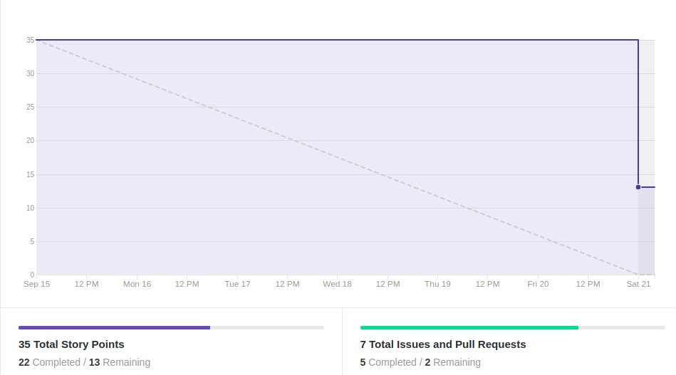
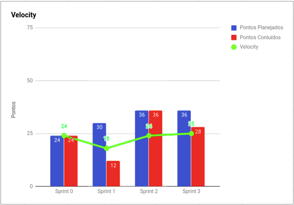
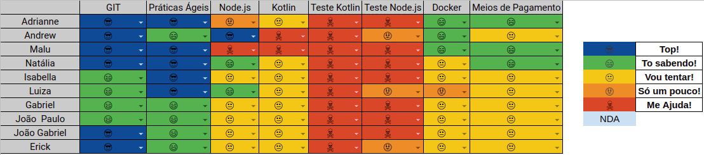

# Resultados 

## 1. Indicadores de Produtividade da Equipe

### 1.1 Fechamento da Sprint 

**Pontos planejados: 35 pontos**
 
**Pontos concluídos: 22 pontos**
 
**Dívida para a próxima Sprint: 5 pontos**
 
**Pontos Cancelados: 8 pontos**

| Atividade | Situação |
| --------  | :----:   |
|[US04 - Checar Elegibilidade de Uso de Cheque Especial - Backend](https://github.com/fga-eps-mds/2019.2-Grupo2/issues/51) | Concluído | 
| [US06 - Acompanhar limite de crédito - BackEnd](https://github.com/fga-eps-mds/2019.2-Grupo2/issues/33) | Dívida Técnica| 
|[US15 - Criar Perfil do Usuário - Backend](https://github.com/fga-eps-mds/2019.2-Grupo2/issues/31)| Concluído| 
|[US16 - Manter conta de pagamento - Backend](https://github.com/fga-eps-mds/2019.2-Grupo2/issues/38)| Concluído| 
|[US02 - Solicitar Crédito](https://github.com/fga-eps-mds/2019.2-Grupo2/issues/30)|Cancelada |
| [D05 - Fazer Protótipos de Baixa Fidelidade](https://github.com/fga-eps-mds/2019.2-Over26/issues/12) | Concluído | 
| [Criar Protótipo de Alta Fidelidade ](https://github.com/fga-eps-mds/2019.2-Grupo2/issues/49) | Concluído | 

## 1.2 Burndown

## 1.3 Velocity   

## 1.4 Retrospectiva 
| Membro | Pontos Positivos | Pontos Negativos | Sugestão de Melhoria | Pontuação das Histórias |
| --------  | :----:   | :----:   | :----:   | :----:   |
| Adrianne |  A comunicação EPS/MDS melhorou, MDS mais reativo, EPS se organizou melhor, definição final de escopo e produto auxiliou no alinhamento de toda equipe, motivação da sprint após reunião com o cliente melhorou a produtividade e engajamento da equipe, melhor organização do github do projeto | Mudança de escopo e backlog no meio da sprint, necessidade de replanejamento e refatoração de documento após a reunião com o cliente | EPS passar a pontuar as próprias histórias, melhor documentar as atividades feitas pela equipe em issues do projeto, melhorar comunicação nas issues e pull requests por meio de comentários, fazer treinamento de testes para MDS, programar melhor os lanchinhos do sábado (kk), start nos testes :D  | Ok | 
| Andrew | Houve a melhora na comunicação, equipe mais entrosada, descoberta de como comunicar backend e frontend | Mudança no meio da sprint, e falta de definição de testes unitários no backend  | Melhorar ambiente de teste no backend, criar CI do bakcend para automatizar builds | OK |
| Maria Luiza | A comunicação melhorou, fiquei feliz com a entrega de MDS e o aprendizado dessa sprint, além do melhor funcionamento dos pareamentos. O alinhamento e entendimento do escopo com o cliente. | Mudança de história no meio da sprint, a comunicação pode ser melhorada, entendimento do escopo no meio da sprint com a reunião com o cliente, atualizar backlog no meio da sprint. Colocar duas histórias dependentes da mesma sprint | Melhorar a comunicação ainda mais e EPS conseguir ajudar mais MDS com a questão de código |OK |
| Natália | Melhoria na comunicação, "treinamento de Kotlin", avanço no conhecimento de MDS e amadurecimento tanto da equipe de EPS quanto do escopo. | A disciplina exige muito esforço de ambas as equipes, as outras matérias estão ficando de lado. Ainda não conseguimos deixar a parte de Qualidade definida e MDS ainda está um pouco dependente. | Sentar e definir como se dará a realização dos testes, assim como as formas de medir a qualidade de código (fazer um plano de medição); Organizar melhor o tempo e planejar as atividades que devem ser realizadas; Pensar bem os pareamentos de MDS para que haja uma difusão do conhecimento. | OK |
| Isabella | - | - | - | - | - |
| Luiza | Houve bastante interação entre os membros de MDS , as equipes ajudaram umas as outras através de dúvidas, hangouts e etc. Comunicação melhorou, escopo do projeto melhor definido.|Dificuldade com as tecnologias e dificuldade de testar, imprevistos acabaram afetando a sprint de maneira negativa|Melhorar a comunicação, se possível treinamento sobre como usar a plataforma e como testar as funcionalidades |Pontuação OK | |
| Gabriel | A comunicação entre os integrantes dos grupos melhorou, treinamentos bastante eficientes e boas entregas do grupo de MDS. | Mudança de sprint. | Pedir ajuda com antecedência. | OK | |
| Erick | Melhor comunicação, treinamento de node e escopo bem definido | Mudança da sprint durante a semana e problemas com relação aos testes unitários. | Melhorar a comunicação | OK |
| João Gabriel | Apesar da dificuldade, conseguimos aprender a fazer as requisições de dentro do front e isto deve facilitar daqui em diante. | Falta de cominicação entre os pares fez com que fizessem coisas praticamente iguais que podiam ter sido copiadas.  | Novamente,melhoria na comunicação.Pessoas com dificuldade deixaram para ultima hora para se manifestar. | OK| 
| João Paulo | Grande aprendizado em node js e kotlin com os treinamentos, tudo proposto foi entregue e todos realizaram bons trabalhos, comunicação também melhorou bastante entre os grupos e também dentro do grupo de MDS | Algumas mudanças no meio da sprint confundiram um pouco. | Continuar melhorando a comunicação e tentar apresentar os problemas o mais cedo possível. |  OK| 

## 1.6 Quadro de conhecimento

# 2. Visão do Tech Leader
Essa sprint teve 35 pontos planejados, porém somente 22 pontos concluídos.

 Houve uma falha de planejamento, devido a falta de entendimento do escopo do projeto. Isso resultou na mudança de tarefa no meio da sprint, cancelando a história [US02 - Solicitar Crédito](https://github.com/fga-eps-mds/2019.2-Grupo2/issues/30) e inserindo a história [US16 - Manter conta de pagamento - Backend](https://github.com/fga-eps-mds/2019.2-Grupo2/issues/38). Esse replanejamento no meio da sprint foi devido ao erro de entendimento do escopo, o que resultou em um erro no planejamento. O que prejudicou a produtividade e dificuldade de entendimento de quais as atividades seriam executadas pelo paremento do Erick e Gabriel. Outra falha no planejamento foi a dependência de duas histórias na mesma sprint, o que resultou na execução de códigos iguais ao final da sprint, pois as duas histórias dependendiam de uma mesma Model que foi criada duas vezes. 

A falha no entendimento do escopo e a inexperiência de MDS não permitiu a iniciação dos teste unitários no Backend, o que resultou na falta de qualidade dos entregáveis da equipe. 

Outra questão crítica envolve problemas de saúde e pessoais de alguns membros da equipe de MDS, o que resultou no atraso das atividades durante a sprint, acumulando para o final da mesma, como pode-se ver no Burndown. Porém no Velocity, a equipe permaneceu com uma produtividade semelhante da sprint passada.

As práticas ágeis foram aplicadas, com reuniões diárias via Telegram e reuniões semanais de planejamento ocorrida no início da sprint. Além das reuniões de retrospectiva e revisão ocorridas no final da sprint. Essas reuniões ocorrem todos os sábados presencialmente. A comunicação melhorou entre a equipe, porém há a necessidade de melhorar ainda mais nas próximas sprints para melhor produtividade dos membros. 
