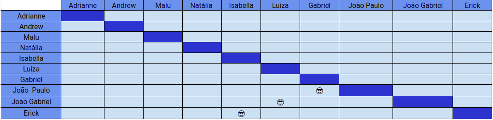

# Planejamento SPRINT 4

**Data de início**: 22/09/2019  
**Data de fim**: 28/09/2019  
**Duração**: 1 semana  
**Pontuação**: 47 pontos 

## 1. Objetivo

Fazer funcionalidades que agreguem valor ao projeto priorizadas pela Product Owner. **A pontuação utilizada será baseada na escala Fibonacci ( 1, 2, 3, 5, 8, 13)**

## 2. Papéis 

* **Scrum Master:** Maria Luiza
* **Product Owner:** Adrianne Alves
* **Devops:** Andrew Lucas
* **Architect:** Natália Maria

## 3. Backlog da Sprint 3

### Overview
| Atividade | Pontuação | Responsável | Dívida |
| -------- | :----: | :----: | :----: |
| [US02 - Interface Cash-in](https://github.com/fga-eps-mds/2019.2-Grupo2/issues/40) | 5 | João Paulo e Gabriel | Não|
|[US01 - Cash Out](https://github.com/fga-eps-mds/2019.2-Grupo2/issues/41) | 5 | João Paulo e Gabriel |Não |
| [US05 - Ativar cheque especial - Backend](https://github.com/fga-eps-mds/2019.2-Grupo2/issues/42)| 3 | João Paulo e Gabriel  |Não|
| [US17 - Parcelar a dívida após os 26 dias - Back](https://github.com/fga-eps-mds/2019.2-Grupo2/issues/43)| 8 |  João Gabriel e Luiza |Não|
| [US17 - Parcelar a dívida após os 26 dias - Front](https://github.com/fga-eps-mds/2019.2-Grupo2/issues/44)| 5 |  João Gabriel e Luiza |Não|
| [US14 - Acompanhar dívida - Back](https://github.com/fga-eps-mds/2019.2-Grupo2/issues/45)| 5 |  Erick e Isabela |Não|
| [US14 - Acompanhar dívida - Front](https://github.com/fga-eps-mds/2019.2-Grupo2/issues/46)| 8 |  Erick e Isabela |Não|
| [US06 - Acompanhar limite de crédito - BackEnd](https://github.com/fga-eps-mds/2019.2-Grupo2/issues/33) | 8 | Luiza e Isabella |Sim |

## 4. Pareamento

