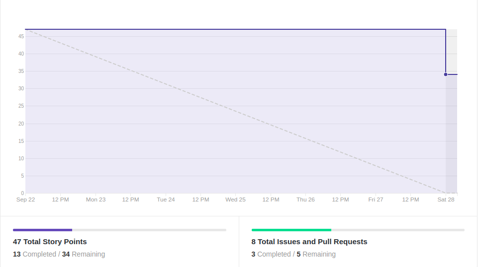
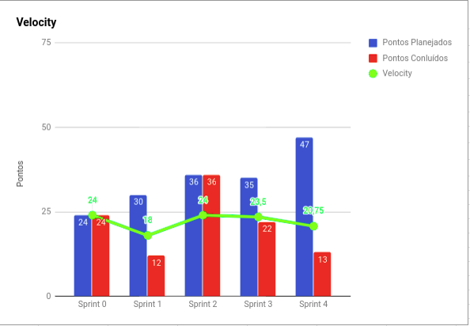
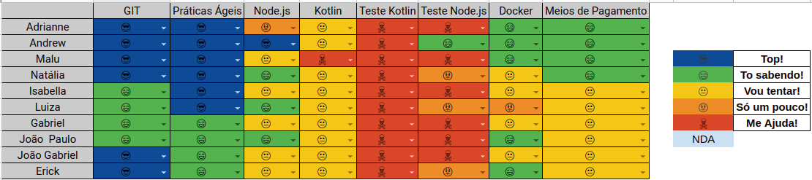

# Resultados 

## 1. Indicadores de Produtividade da Equipe

### 1.1 Fechamento da Sprint 

**Pontos concluídos: 13 pontos concluídos**
 
**Dívida Técnica: 34 pontos de dívida**

| Atividade | Situação |
| --------  | :----:   |
|[US02 - Interface Cash-in](https://github.com/fga-eps-mds/2019.2-Grupo2/issues/40) | Concluído | 
| [US01 - Cash Out](https://github.com/fga-eps-mds/2019.2-Grupo2/issues/41)| Concluído | 
| [US05 - Ativar cheque especial - Backend](https://github.com/fga-eps-mds/2019.2-Grupo2/issues/42)| Concluído | 
| [US17 - Parcelar a dívida após os 26 dias - Back](https://github.com/fga-eps-mds/2019.2-Grupo2/issues/43) | Dívida Técnica | 
|[US17 - Parcelar a dívida após os 26 dias - Front](https://github.com/fga-eps-mds/2019.2-Grupo2/issues/44) | Dívida Técnica | 
| [US14 - Acompanhar dívida - Back](https://github.com/fga-eps-mds/2019.2-Grupo2/issues/45) | Dívida Técnica | 
|[US14 - Acompanhar dívida - Front](https://github.com/fga-eps-mds/2019.2-Grupo2/issues/46) | Dívida Técnica  | 
| [US06 - Acompanhar limite de crédito - BackEnd](https://github.com/fga-eps-mds/2019.2-Grupo2/issues/33) | Dívida Técnica | 

## 1.2 Burndown

## 1.3 Velocity   

## 1.4 Retrospectiva 
| Membro | Pontos Positivos | Pontos Negativos | Sugestão de Melhoria | Pontuação das Histórias |
| --------  | :----:   | :----:   | :----:   | :----:   |
| Adrianne | Semana universitária possibilitou o desenvolvimento de maior número  de atividades, desenvolvimento de documentações faltantes, mds mais engajados e com maior agilidade para fazer as suas atividades | Planejamento falho devido à dependência entre as tarefas, MDS viajando, dificuldade de organização das tarefas | Redução do escopo de entrega para a R1, organização com prazo para cumprimento das atividades | Ok |
| Andrew | Melhora na comunicação, MDS conseguindo resolver alguns erros por conta propria | Histórias muito grande, gabriel viajou, muitos erros travando o andamento | Melhorar o pareamento, resolver problemas para rodar projeto android em todas as máquinas | Não, melhor quebrar em mais as histórias  |
| Maria Luiza | Mais tempo disponível e melhor domínio de MDS com as tecnologias, semana universitária | Planejamento falho, menos um MDS devido a viagem, problemas pessoais de alguns membros, história muito grande sem conseguir concluir, falha na organização dos membros de EPS | Melhorar o planejamento, reduzir o escopo da R1 | Falho (histórias muito grandes) |
| Natália | Semana universitária, MDS tá trabalhando bastante, mais tempo e mais reuniões na Sprint. | Muita coisa pra fazer, tecnologias não estão ajudando (principalmente o Android Studio), não tenho tempo para as outras matérias. | Mais calma na hora de planejar as coisas. | Eu acho que algumas histórias foram subestimadas, deveriam ter a pontuação maior, se considerando outros problmeas como o pouco domínio das tecnologias por parte de MDS. |
| Isabella | Mais tempo para realizar as tarefas | Problemas de comunicação e com o Android Studio que dificultaram a finalização da sprint  |Aumentar o tempo para as histórias maiores e dividir as tarefas parecidas |Ok |
| Luiza |Todo mundo está trabalhando e se esforçando apesar das dificuldades, a equipe esta bem mais colaborativa, EPS ajudou muito| Os erros que tivemos tomaram muito tempo da sprint, algumas dificuldades com a tecnologia, tempo curto| Melhor planejamento de tempo, treinamentos com as tecnologias | Pontuação baixa, história muito dificil|
| Gabriel | -| - | - | - | - |
| Erick | Todos tem trabalhado bastante. EPS deu muito apoio.| Problemas com o Android Studio e ferramentas e Sprint muito pesada.| Melhorar a divisão de histórias. | Algumas histórias foram mais pesadas do que esperado. |
| João Gabriel |Mais tempo livre (semana universitaria) | Muitas dividas desta sprint. | Maior fragmentação das historias | Pontuação muito baixa, não condizente com a realidade|
| João Paulo | Grande melhora da comunicação, tempo para realizar as tarefas e esforço de todos os membros. | Problemas em relação ao Android Studio, grande quantidade de issues e tamanho dels. | Melhor planejamento. | Falha em algumas histórias pelo seu tamanho |

## 1.6 Quadro de conhecimento

# 2. Visão do Tech Leader
Essa sprint foi planejada com 47 pontos, porém somente 13 pontos foram entregues. 

Foi planejado muitas histórias para essa sprint, devido a semana universitária, onde os estudantes não teriam aulas e a expectativa era que pudessémos fazer mais pontos e ter mais disponibilidade para trabalhar no projeto. Porém, houve falha no planejamento, pois as histórias ficaram muito grande e, por isso, não foram concluídas a tempo. Este fato, foi refletido diretamente no Velocity. Outro fator crítico nessa sprint foi devido a viagem de um dos membros de MDS, Gabriel e problemas saúde de outros membros.  

A dificuldade de realizar as tarefas, devido a tecnologia e ao tamanho das histórias, os testes unitários continuaram comprometidos, nessa sprint. O que causa problema na qualidade do código e produto entregues. 

Para resolver este problema, será feita uma adaptação no escopo e replanejamendo das atividades que serão entregue na R1. Restringindo o escopo da R1 em: ativar cheque especial, ajustar limite de crédito e parcelamento da dívida.

Para resolver este problema, foi feita uma adaptação no escopo que será entregue na R1.

A comunicação tem melhorado a cada sprint e a colaboração do grupo também, apesar das dificuldades com a tecnologia e os imprevistos pessoais de cada membro. 

As práticas ágeis foram aplicadas, com reuniões diárias via Telegram e reuniões semanais de planejamento ocorrida no início da sprint. Além das reuniões de retrospectiva e revisão ocorridas no final da sprint. Essas reuniões ocorrem todos os sábados presencialmente.