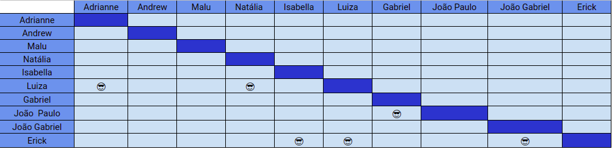

# Planejamento SPRINT 5

**Data de início**: 29/09/2019  
**Data de fim**: 03/10/2019  
**Duração**: 5 dias  
**Pontuação**: 47 pontos 

## 1. Objetivo

Fazer funcionalidades que agreguem valor ao projeto priorizadas pela Product Owner. **A pontuação utilizada será baseada na escala Fibonacci ( 1, 2, 3, 5, 8, 13)**

## 2. Papéis 

* **Scrum Master:** Maria Luiza
* **Product Owner:** Adrianne Alves
* **Devops:** Andrew Lucas
* **Architect:** Natália Maria

## 3. Backlog da Sprint 3

### Overview
| Atividade | Pontuação | Responsável | Dívida |
| -------- | :----: | :----: | :----: |
| [US17 - Parcelar a dívida após os 26 dias - Back](https://github.com/fga-eps-mds/2019.2-Grupo2/issues/43)| 13 |  João Gabriel, Luiza e Erick |Sim|
| [US17 - Parcelar a dívida após os 26 dias - Front](https://github.com/fga-eps-mds/2019.2-Grupo2/issues/44)| 13 |  João Gabriel, Luiza e Erick |Sim|
| [US06 - Acompanhar limite de crédito - BackEnd](https://github.com/fga-eps-mds/2019.2-Grupo2/issues/33) | 8 | João Paulo e Gabriel |Sim |
| [Revisar e refatorar documento de arquitetura](https://github.com/fga-eps-mds/2019.2-Over26/issues/78) | 3 | Isabella e Natália | Não |
| [Testes unitários](https://github.com/fga-eps-mds/2019.2-Over26/issues/81) | 5 | Andrew | Não |
| [Revisar e refatorar Documento de Visão](https://github.com/fga-eps-mds/2019.2-Over26/issues/79)|3 | Adrianne e Isabella |Não|
| [Fazer a apresentação](https://github.com/fga-eps-mds/2019.2-Over26/issues/80) | 2 | Todos | Não |

### EPS
| Atividade | Responsável |
| -------- | :----: |
| [Plano de Qualidade]() | Natália  |
| [Fazer Burndown de Riscos](https://github.com/fga-eps-mds/2019.2-Over26/issues/72)  | Maria Luiza |
| [Criar documento de Gerenciamento de Riscos](https://github.com/fga-eps-mds/2019.2-Over26/issues/65) | Maria Luiza |
| [Documentar sprint 4](https://github.com/fga-eps-mds/2019.2-Over26/issues/63) | Maria Luiza |
| [Documentar sprint 5](https://github.com/fga-eps-mds/2019.2-Over26/issues/77) | Maria Luiza |
| [Definir métricas de produtividade](https://github.com/fga-eps-mds/2019.2-Over26/issues/70) | Maria Luiza |
| Deploy do Backend | Andrew |
| Documentar a parte do Devops | Andrew |
| Gerar Release | Andrew |
| Refatorar EAP | Adrianne |
| Documentar Elicitação de requisitos | Adrianne |

## 4. Pareamento

