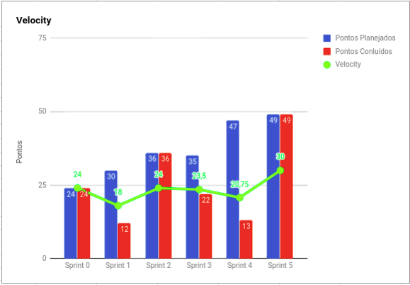
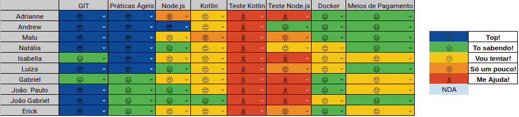

# Resultados 

## 1. Indicadores de Produtividade da Equipe

### 1.1 Fechamento da Sprint 

**Pontos concluídos 49 pontos**

| Atividade | Situação |
| --------  | :----:   |
| [US17 - Parcelar a dívida após os 26 dias - Back](https://github.com/fga-eps-mds/2019.2-Grupo2/issues/43) | Concluída | 
|[US17 - Parcelar a dívida após os 26 dias - Front](https://github.com/fga-eps-mds/2019.2-Grupo2/issues/44)| Concluída|
|[US06 - Acompanhar limite de crédito - BackEnd](https://github.com/fga-eps-mds/2019.2-Grupo2/issues/33)|Concluída|
|[Revisar e refatorar documento de arquitetura](https://github.com/fga-eps-mds/2019.2-Over26/issues/78)|Concluída|
|[Testes unitários](https://github.com/fga-eps-mds/2019.2-Over26/issues/81)|Concluída|
|[Revisar e refatorar Documento de Visão](https://github.com/fga-eps-mds/2019.2-Over26/issues/79)|Concluída|
|[Fazer a apresentação](https://github.com/fga-eps-mds/2019.2-Over26/issues/80)| Concluída|

### EPS
| Atividade | Situação |
| -------- | :----: |
| [Fazer Burndown de Riscos](https://github.com/fga-eps-mds/2019.2-Over26/issues/72)  | Concluída |
| [Criar documento de Gerenciamento de Riscos](https://github.com/fga-eps-mds/2019.2-Over26/issues/65) | Concluída |
| [Documentar sprint 4](https://github.com/fga-eps-mds/2019.2-Over26/issues/63) | Concluída |
| [Documentar sprint 5](https://github.com/fga-eps-mds/2019.2-Over26/issues/77) | Concluída |
| [Definir métricas de produtividade](https://github.com/fga-eps-mds/2019.2-Over26/issues/70) | Concluída |
| Refatorar EAP | Concluída |
| Deploy do Backend | Dívida Técnica |
| Documentar a parte do Devops | Dívida Técnica |
| Gerar Realease | Dívida Técnica |
| Documentar Elicitação de requisitos | Dívida Técnica |
| Plano de Qualidade |  Dívida Técnica |

## 1.2 Burndown

## 1.3 Velocity   

## 1.4 Retrospectiva 
| Membro | Pontos Positivos | Pontos Negativos | Sugestão de Melhoria | Pontuação das Histórias |
| --------  | :----:   | :----:   | :----:   | :----:   |
| Adrianne | Adiamento da R1, melhor mapeamento de problemas no time, por parte de EPS, início das histórias mais cedo na sprint por parte de MDS, EPS mais produtivo na documentação, refatoração e clareza total do problema| Viagem de membro, problemas de saúde, curto prazo e número de atividades a serem feitas alta, as histórias estavam muito grandes. | Quebrar as histórias de modo que fiquem mais atômicas, fortalecer o escopo e objetivo do produto para a equipe de MDS.| Acredito que as pontuações foram muito abaixo considerando as dificuldades que MDS enfrentou, entretanto, acredito que a divisão das histórias resolve ou melhora esse ponto. |
| Andrew | Adiamento da R1, resolvemos muitos problemas tecnicos, teste unitários | Muita coisa para refatorar, melhorar, historias grandes demais | quebrar as historias em issues menores, aumentar a cobertura de teste, melhorar apresentação da R1 | Baixa em relação a realidade, mas se fossem historias menores, seriam melhores pontuadas| 
| Maria Luiza | Adiamento da R1, melhor planejamento das atividades de EPS, MDS conseguiu fazer bastante coisa e evoulir muito no conhecimento das tecnologias, amadurecimento do escopo do projeto.| Sprint curta para fazer muitas coisas, histórias grandes demais, falha nos pareamentos, problemas pessoais de membros da equipe. | Quebrar mais as histórias e melhor planejamento das atividades durante a sprint, melhor monitoramento dos pareamentos. | Não, histórias mal pontuadas e muito grandes. |
| Natália | Adiamento da R1, todo mundo se empenhando em fazer as coisas. | Muita coisa pra fazer e sprint curta. | Começar a quebrar melhor as histórias e planejar melhor os pareamentos. | Acho que temos que repontuar a US17. | |
| Isabella | A R1 foi adiada e achei a divisão de tarefas mais compacta.| Prazo mais curto considerando que a R1 não seria adiada. | Quebrar mais as histórias para conseguir entregar tudo que for planejado. | Pontuação Ok. | |
| Luiza | A R1 foi adiada o que foi melhor pra poder fazer as tarefas com maior qualidade| As coisas foram muito corridas da semana passada pra ca e tive coisas pessoais pra resolver o que atrapalhou nas tarefas | Tarefas mais compactas para melhor entendimento e organização para cumpri-las| ok| |
| Gabriel | Mais tempo para se preparar para a R1 e o grupo esta cada vez mais comunicativo | Histórias muito longas. | Dividir melhor as histórias | Ok | |
| Erick | Adiamento da R1, adptação à IDE.| Histórias grandes e prazo curto. | Dividir as histórias. | Pontuação não coerente com o tamanho das histórias. | |
| João Gabriel |Adiamento da R1. | Prazo curto. | Historias mais curtas. |Pontuação muito baixa em relação à realidade. | |
| João Paulo | Adiamento da R1, grupo mais comunicativo e algumas melhorias no projeto | Prazo curto e histórias muito grandes, confusão em algumas partes do código | Quebrar as histórias em partes menores, não dependencia de uma história da outro. | Algumas histórias com pontuação não condizente | |

## 1.6 Quadro de conhecimento

# 2. Visão do Tech Leader
A duração dessa sprint teve que ser adaptada devido a data da Release 1, sendo de 5 dias.
Foram planejados 49 pontos e todas as atividades foram entregues pelo time. Houve uma melhora significativa da produtividade da equipe, como se pode visualizar no Velocity. Além de uma melhora nas entregas das atividades durante a sprint, como se pode visualizar no Burndown. 

Nesta sprint foram resolvidas algumas dívidas técnicas da sprint 4, devido às histórias estarem muito grandes, o que dificultou a entrega. 

A equipe tem se mostrado bastante produtiva, além de ter evoluído bastante com relação ao conhecimento das tecnologias utilizadas.

As atividades de EPS começaram a ser planejadas, juntamente com as atividades de MDS, porém sem pontuação. A decisão da equipe foi de não pontuar para que os gráficos mantenham as métricas somente da equipe de desenvolvimento do produto.

O erro da sprint se encontrou novamente em histórias muito longas, se repetindo devido às dívidas técnicas. Além do prazo curto para realizar muitas tarefas. O pareamento entre MDS não tem se demonstrado muito eficaz, devido à indisponibilidade da equipe de parear. O que demonstra a necessidade de um melhor monitoramento dos pareamentos.

As práticas ágeis foram aplicadas, com reuniões diárias via Telegram e reuniões semanais de planejamento ocorrida no início da sprint. Além das reuniões de retrospectiva e revisão ocorridas no final da sprint.  Excepcionalmente, essas reuniões ocorreram durante a semana (via Hangouts), devido ao adiamento da Release 1. Então houve retrospectiva, revisão e planejamento da sprint 6.
