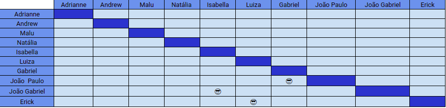

# Planejamento SPRINT 6

**Data de início**: 03/10/2019  
**Data de fim**: 07/10/2019  
**Duração**: 5 dias  
**Pontuação**: 29 pontos 

## 1. Objetivo

Refatorar documentos e funcionalidades feitas e refinar apresentação da Release 1 com a equipe toda. **A pontuação utilizada será baseada na escala Fibonacci ( 1, 2, 3, 5, 8, 13)**

## 2. Papéis 

* **Scrum Master:** Maria Luiza
* **Product Owner:** Adrianne Alves
* **Devops:** Andrew Lucas
* **Architect:** Natália Maria

## 3. Backlog da Sprint 3

### Overview
| Atividade | Pontuação | Responsável | Dívida |
| -------- | :----: | :----: | :----: |
| [TS02 - Criar método de update no OverdraftDebt - Backend](https://github.com/fga-eps-mds/2019.2-Over26/issues/93)| 2 | Isabela e João Gabriel | Não|
|[TS04 - Corrigir requisição de parcelamento - Frontend](https://github.com/fga-eps-mds/2019.2-Over26/issues/97) | 5 |  Erick e Luiza |Não|
| [TS05 - Modificar os ícones do aplicativo - Frontend](https://github.com/fga-eps-mds/2019.2-Over26/issues/98) | 3 | Gabriel e João Paulo |Não|
| [TS06 - Testes das novas controllers -Backend](https://github.com/fga-eps-mds/2019.2-Over26/issues/99) | 5 | Andrew e MDS |Não|
| [TS01 - Refatorar as controllers - Backend](https://github.com/fga-eps-mds/2019.2-Over26/issues/92) | 5 | João Gabriel e Isabela |Não|
| [TS07 - Padronizar rotas com IDs - Backend](https://github.com/fga-eps-mds/2019.2-Over26/issues/100) | 2 |  Gabriel e João Paulo |Não|
| [TS03 - Refatorar as Models - Backend](https://github.com/fga-eps-mds/2019.2-Over26/issues/94) | 2| Erick e Luiza | Não|
| [TS08 - Padronizar rotas com IDs - Frontend](https://github.com/fga-eps-mds/2019.2-Over26/issues/101)| 2 | Gabriel e João Paulo  |Não|
| [Refinar apresentação](https://github.com/fga-eps-mds/2019.2-Over26/issues/102) | 3 |  Todos |Não|

### EPS
| Atividade | Responsável |
| -------- | :----: |
| Plano de Qualidade | Natália  |
| Deploy do Backend | Andrew |
| Documentar a parte do Devops | Andrew |
| Gerar Realease | Andrew |
| Documentar Elicitação de requisitos | Adrianne |
| Documentar Sprint 6 | Maria Luiza |

## 4. Pareamento
