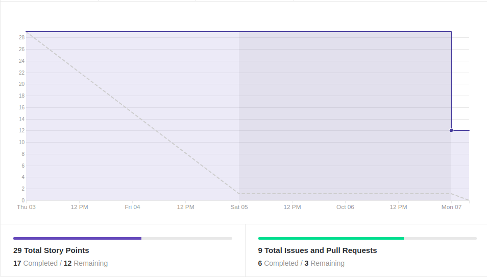
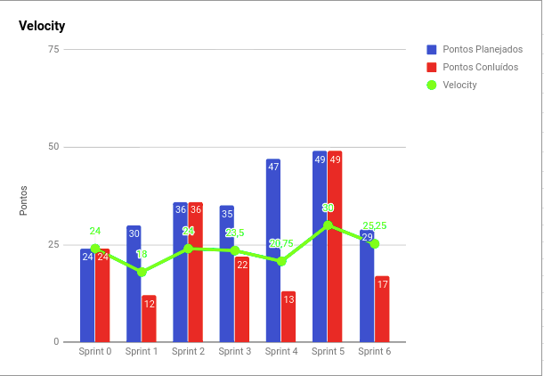
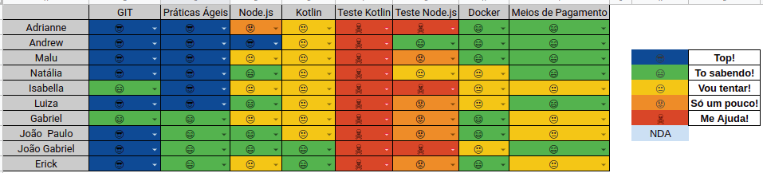

# Resultados 

## 1. Indicadores de Produtividade da Equipe

### 1.1 Fechamento da Sprint 

**Pontos concluídos: 29 pontos**
**Pontos cancelados: 2 pontos**
**Dívida Técnica: 12 pontos**

| Atividade | Situação |
| --------  | :----:   |
| [TS02 - Criar método de update no OverdraftDebt - Backend](https://github.com/fga-eps-mds/2019.2-Over26/issues/93) | Cancelada | 
| [TS04 - Corrigir requisição de parcelamento - Frontend](https://github.com/fga-eps-mds/2019.2-Over26/issues/97) | Concluída | 
| [TS05 - Modificar os ícones do aplicativo - Frontend](https://github.com/fga-eps-mds/2019.2-Over26/issues/98)  | Concluída | 
| [TS06 - Testes das novas controllers -Backend](https://github.com/fga-eps-mds/2019.2-Over26/issues/99) | Dívida Técnica | 
| [TS01 - Refatorar as controllers - Backend](https://github.com/fga-eps-mds/2019.2-Over26/issues/92) | Dívida Técnica | 
| [TS07 - Padronizar rotas com IDs - Backend](https://github.com/fga-eps-mds/2019.2-Over26/issues/100) | Concluída |
| [TS03 - Refatorar as Models - Backend](https://github.com/fga-eps-mds/2019.2-Over26/issues/94) | Dívida Técnica | 
| [TS08 - Padronizar rotas com IDs - Frontend](https://github.com/fga-eps-mds/2019.2-Over26/issues/101) | Concluída | 
| [Refinar apresentação](https://github.com/fga-eps-mds/2019.2-Over26/issues/102) | Concluída |

### EPS
| Atividade | Situação |
| -------- | :----: |
| Deploy do Backend | Dívida Técnica |
| Documentar a parte do Devops | Dívida Técnica |
| Gerar Realease | Concluída |
| Documentar Elicitação de requisitos | Concluída |
| Plano de Qualidade |  Concluída |
| Documentar Sprint 6 |  Concluída |

## 1.2 Burndown

## 1.3 Velocity 

## 1.4 Retrospectiva 
| Membro | Pontos Positivos | Pontos Negativos | Sugestão de Melhoria | Pontuação das Histórias |
| --------  | :----:   | :----:   | :----:   | :----:   |
| Adrianne | Extensão do prazo da R1, que permitiu refatorar algumas entregas.| Dependência entre histórias, celular quebrado (o que piorou a minha comunicação), membros ausentes e pouca proatividade | Membros devem se organizar melhor individualmente para entregar o que se comprometeu a fazer, conflitos entre membros devem ser resolvidos imediatamente, mds precisa conhecer o conceito de pertencimento do código | Acredito que o problema referente à pontuação diz respeito ao baixo compromisso da equipe com as entregas. | |
| Andrew | Conseguimos melhorar um pouco o codigo do front, e histórias menores para facilitar o andamento | Ausencia de muitos membros durante o fim de semana, historias dependende umas das outras travou um pouco um andamento | Melhorar a proatividade da equipe, criar cultura de ravisar pr assim que forem abertos, melhorar a comunicação | Os pontos foram ok, porem a equipe nao colaborou com o planejado | 
| Maria Luiza | Adiamento da R1 e mais tempo para realizar as tarefas para a R1 | Pendência de PR, o que atrasou as outras atividades, entregas tardias das atividades | Equipe se organizar melhor para entregar as coisas durante a sprint | OK |
| Natália | R1 adiada e histórias mais bem divididas. | Android Studio, dificuldade em rodar o frontend e atraso para analisar e aceitar os PRs do front. | Definir as pessoas que podem analisar os PRs do front, para que a tarefa não fique concentrada em uma ou duas pessoas (MDS ajudar) | Ok | |
| Isabella | Histórias mais divididas e deu mais tempo para se preparar par R1 | Tempo mais curto | Organizar tarefas mais simples para quando a sprint for menor | Ok | |
| Luiza | R1 adiada, historias menores e mais divididas, melhor pra terminar a tempo| Sprint menor, todo mundo mexendo na mesma parte e uma coisa influencia na história de todo mundo, meu computador deu problema e atrasou a história | Melhorar comunicaçao | Ok | |
| Gabriel | Adiamento da R1 nos permitiu avançar mais no projeto e nos preparar-mos melhor para a apresentação. | Histórias dependentes de PRs não aceitos. | Melhorar a aceitação dos PRs | OK | |
| Erick | Histórias melhores divididas e pontuadas, tempo para refatoração das entregas | Histórias dependentes e atraso para aceitar PR | Melhorar comunicação para não causar gargalos em tarefas | Ok | |
| João Gabriel |R1 adiada | Entregas muito em cima da hora | Explicar melhor a tarefa que será feita quando alguem for trabalhar com algo com o que não tem familiaridade  | OK | |
| João Paulo | Adiamento da R1, tempo pra fazer as tarefas | Tempo curto | Melhor organização | OK | |

## 1.6 Quadro de conhecimento

# 2. Visão do Tech Leader
Essa sprint foi de refatoração e ajuste de algumas funcionalidades planejadas para a Release 1, ela ficou com duração de 5 dias, devido a data da R1 ter sido alterada. Foram planejados 29 pontos, porém foi cancelada a [TS02 - Criar método de update no OverdraftDebt - Backend](https://github.com/fga-eps-mds/2019.2-Over26/issues/93), pois não há a necessidade de ter um método para atualizar a dívida.  

Os testes ficaram de dívida técnica, pois não deu para testar todas as novas controllers. Além da rafatoração das models e controllers no backend, devido a grande quantidade de conflitos nessas atividades, pois estavam mexendo em locais comuns. 

Essa sprint foi de grande valia para o projeto, pois foi necessário refatorar muitas coisas para que o projeto desse uma continuidade melhor, em relação ao código. Apesar de não ter sido entregue todas as histórias planejadas, devido a grande quantidade de conflitos existente e sem tempo para resolvê-los com cuidado. Além de termos quebrado melhor as histórias no planejamento, o que deu mais fluidez  à sprint. 

Porém, não houve muita disponibilidade dos membros da equipe para realizar as tarefas durante a sprint, acumulando muito trabalho para o final. A comunicação voltou a ser um gargalo nessa sprint.

As práticas ágeis foram aplicadas, com reuniões diárias via Telegram (nem todos os membros responderam a daily, mesmo insistindo que respondessem) e reuniões semanais de planejamento ocorrida no início da sprint. Além das reuniões de retrospectiva e revisão ocorridas no final da sprint.  Excepcionalmente, essas reuniões ocorreram durante a semana (via Hangouts e Telegram), devido ao adiamento da Release 1.
