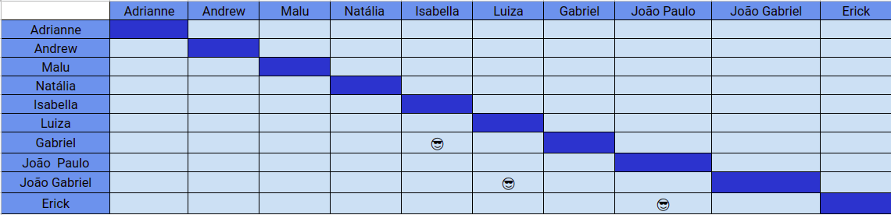

# Planejamento SPRINT 7

**Data de início**: 12/10/2019  
**Data de fim**: 21/10/2019  
**Duração**: 10 dias  
**Pontuação**: 26 pontos 

## 1. Objetivo

Fazer funcionalidades priorizadas pela product owner em conjunto com o a scrum master. **A pontuação utilizada será baseada na escala Fibonacci ( 1, 2, 3, 5, 8, 13)**

## 2. Papéis 

* **Scrum Master:** Maria Luiza
* **Product Owner:** Adrianne Alves
* **Devops:** Andrew Lucas
* **Architect:** Natália Maria

## 3. Backlog da Sprint 3

### Overview
| Atividade | Pontuação | Responsável | Dívida |
| -------- | :----: | :----: | :----: |
|[TS01 - Refatorar as controllers - Backend](https://github.com/fga-eps-mds/2019.2-over26/issues/92) | 2 | Isabela e João Gabriel  | Sim |
|[TS03 - Refatorar as Models - Backend](https://github.com/fga-eps-mds/2019.2-over26/issues/94) | 1 | Erick e Luiza |Sim |
|[TS09 - Refatorar Confirmação de Parcelamento](https://github.com/fga-eps-mds/2019.2-over26/issues/114) | 3 | Andrew e Erick  | Não |
|[US21 - Iniciar Aplicação - Backend](https://github.com/fga-eps-mds/2019.2-over26/issues/113) | 3 | Erick e João Paulo | Não |
|[US01 - Interface Cash Out - Integração](https://github.com/fga-eps-mds/2019.2-over26/issues/112) | 3 | Isabela e Gabriel | Não |
|[US01 - Interface Cash Out - Design](https://github.com/fga-eps-mds/2019.2-over26/issues/111) | 3 | Isabela e Gabriel  | Não |
|[US02 - Interface Cash In - Integração ](https://github.com/fga-eps-mds/2019.2-over26/issues/110) | 3 | Luiza e João Gabriel  | Não |
|[US02 - Interface Cash In - Design](https://github.com/fga-eps-mds/2019.2-over26/issues/109) | 3 | Luiza e João Gabriel | Não |
|[US21 - Iniciar Aplicação - Integração](https://github.com/fga-eps-mds/2019.2-over26/issues/108) | 3 |  Erick e João Paulo | Não |
|[US21 - Iniciar Aplicação - Design](https://github.com/fga-eps-mds/2019.2-over26/issues/107) | 2 |  Erick e João Paulo | Não |

### EPS
| Atividade | Responsável |
| -------- | :----: |
| Deploy do Backend | Andrew |
| Documentar Sprint 7 | Maria Luiza |

## 4. Pareamento
