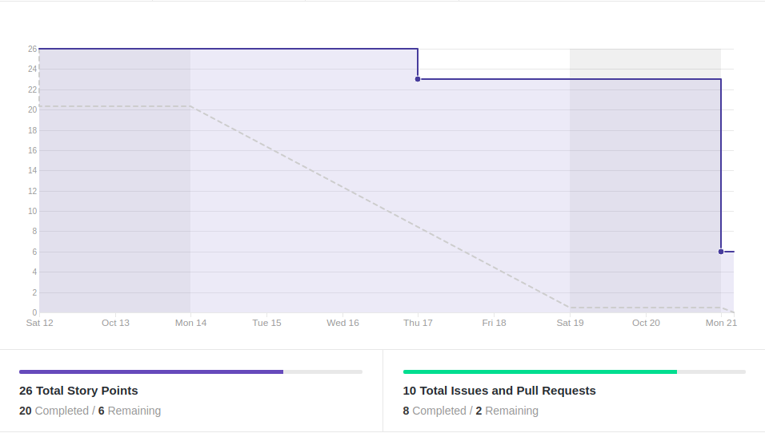
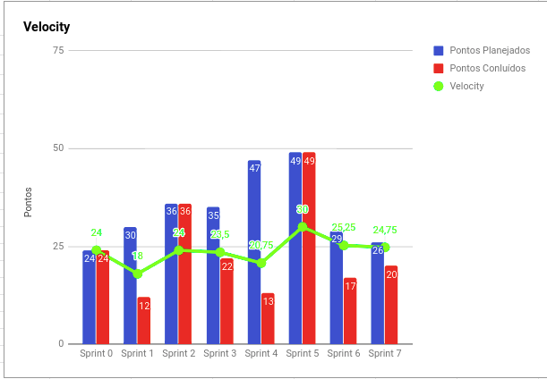
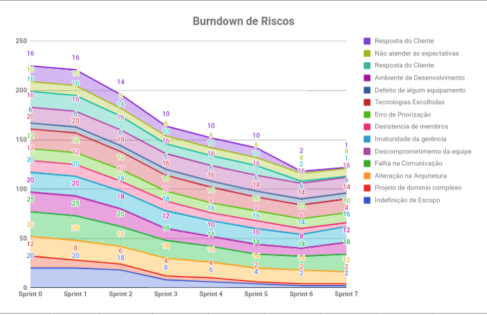
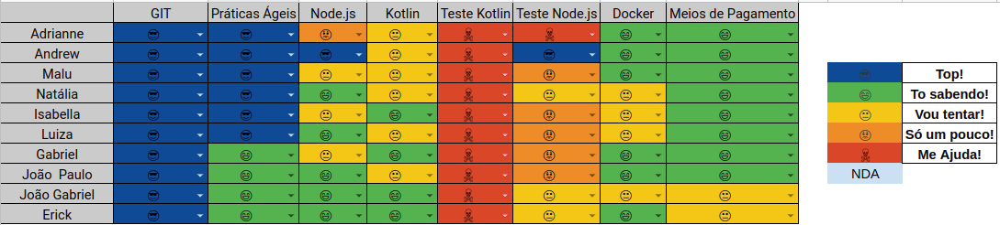

# Resultados 

## 1. Indicadores de Produtividade da Equipe

### 1.1 Fechamento da Sprint 

**Pontos concluídos: 20 pontos**
 
**Dívida Técnica: 6 pontos**

| Atividade | Situação |
| --------  | :----:   |
| [TS01 - Refatorar as controllers - Backend](https://github.com/fga-eps-mds/2019.2-over26/issues/92) | Concluída |
| [TS03 - Refatorar as Models - Backend](https://github.com/fga-eps-mds/2019.2-over26/issues/94) | Concluída |
| [TS09 - Refatorar Confirmação de Parcelamento](https://github.com/fga-eps-mds/2019.2-over26/issues/114) | Dívida Técnica |
| [US01 - Interface Cash Out - Integração](https://github.com/fga-eps-mds/2019.2-over26/issues/112) | Dívida Técnica |
| [US01 - Interface Cash Out - Design](https://github.com/fga-eps-mds/2019.2-over26/issues/111) | Concluída |
| [US02 - Interface Cash In - Integração ](https://github.com/fga-eps-mds/2019.2-over26/issues/110) | Concluída |
| [US02 - Interface Cash In - Design](https://github.com/fga-eps-mds/2019.2-over26/issues/109) | Concluída |
| [US21 - Iniciar Aplicação - Backend](https://github.com/fga-eps-mds/2019.2-over26/issues/113) | Concluída |
| [US21 - Iniciar Aplicação - Integração](https://github.com/fga-eps-mds/2019.2-over26/issues/108) | Concluída |
| [US21 - Iniciar Aplicação - Design](https://github.com/fga-eps-mds/2019.2-over26/issues/107) | Concluída |

### EPS
| Atividade | Situação |
| -------- | :----: |
| Deploy do Backend | Dívida Técnica |
| Documentar Sprint 7 |  Concluída |

## 1.2 Burndown

## 1.3 Velocity 

## 1.4 Burndown de Riscos 

## 1.5 Retrospectiva 
| Membro | Pontos Positivos | Pontos Negativos | Sugestão de Melhoria | Pontuação das Histórias |
| --------  | :----:   | :----:   | :----:   | :----:   |
| Adrianne | Tivemos um bom feedback do que desenvolvemos até agora na R1, MDS está conseguindo ser mais independente | A comunicação piorou consideravelmente devido ao cansaço trazido pela R1,leve desorganizada de toda equipe, baixa produtividade do time em geral  | Reorganizar a equipe, reunião de feedback seria uma boa, enfatizar pareamentos | Ok | |
| Andrew | MDS está aprendendo a testar | Todo mundo relaxou essa sprint | Melhorar a produtividade | Ok | |
| Maria Luiza | MDS está mais maduro com relação ao código e histórias mais curtas | Comunicação piorou muito essa semana, todos os membros deram uma relaxada, de forma geral, tanto EPS quanto MDS | Voltar a melhorar a comunicação e pareamentos | OK |
| Natália | MDS tá bem mais independente, a R1 passou e isso deu uma aliviada em todo mundo. | EPS muito distante a Sprint inteira, alguns membros de MDS mais distantes que outros, algumas histórias não concluídas e comunicação péssima. | Acho que todo mundo tem que ter em mente que a R1 passou, mas o prazo ainda é curto e estamos atrasados. Todo mundo precisa falar mais no grupo também. | Ok | |
| Isabella | Historias mais divididas| Má organização pessoal |  Melhorar comunicação | Ok |
| Luiza | As histórias tiveram pontuação e tempo de execução correto, consegui me organizar no inicio da sprint, as atividades foram bem divididas.| Tive eventos que atrapalharam e ocuparam o meio da sprint | Melhorar comunicação e reduzir o impacto de fatores além da matéria na sprint | Ok | |
| Gabriel | Historias com tamanho adequado. | Me organizei mal e não consegui entregar todas as historias. | Melhorar organização pessoal.| Ok | |
| Erick | Histórias bem adequadas. | Falta de comunicação e demora para revisão de PR. | Retomar a comunicação. | Ok | |
| João Gabriel | Historias mais curtas. |Pouco tempo livre por causa das provas. |Melhorar organização de tempo e comunicação entre os pareamentos.  |OK.|
| João Paulo | Histórias mais curtas o que facilita o trabalho, bom feedback da R1 | Cansaço pós R1 atrapalhou um pouco o trabalho, um pouco de dificuldade nos testes | Mais comunicação, mais treino com testes | Ok | |

## 1.6 Quadro de conhecimento

# 2. Visão do Tech Leader
Essa sprint foi bem atípica, pois com a Release 1 todos os membros da equipe, tanto de MDS quanto de EPS deram uma relaxada com o projeto. A causa foi todo o estresse e cansaço acumulado até a Release 1. Isso resultou na péssima comunicação entre a equipe o que mostrou uma desorganização. Outro fator crítico, que é necessário ser combatido nas próximas sprints foi o fato de demorar para analisar os PRs feitos, o que atrasou bastante o time de desenvolvimento. Este fato se encontra na dificuldade de alguns membros em utilizar o Android Studio em seus computadores, o que tem aumentado bastante o risco do projeto. 

 Porém, um ponto positivo foi que a equipe de EPS conseguiu planejar histórias mais concisas, o que resultou na maioria das entregas (apesar de duas histórias terem ficado como dívida técnica, devido a má comunicação e desorganização da equipe).

As práticas ágeis ficaram um pouco comprometidas também, principalmente as reuniões diárias via Telegram (nem todos os membros responderam a daily, mesmo insistindo que respondessem). Porém as reuniões de revisão e retrospectiva foram feitas com sucesso, onde os membros puderam expor os pontos positivos e negativos, assim como melhoria para que a equipe alcançasse a produtividade máxima. 