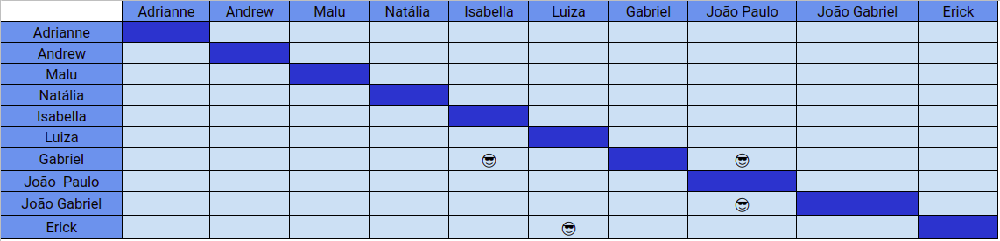

# Planejamento SPRINT 8

**Data de início**: 22/10/2019  
**Data de fim**: 26/10/2019  
**Duração**: 4 dias  
**Pontuação**: 16 pontos 

## 1. Objetivo

Fazer funcionalidades priorizadas pela product owner em conjunto com o a scrum master.. **A pontuação utilizada será baseada na escala Fibonacci ( 1, 2, 3, 5, 8, 13)**

## 2. Papéis 

* **Scrum Master:** Maria Luiza
* **Product Owner:** Adrianne Alves
* **Devops:** Andrew Lucas
* **Architect:** Natália Maria

## 3. Backlog da Sprint 3

### Overview
| Atividade | Pontuação | Responsável | Dívida |
| -------- | :----: | :----: | :----: |
|[TS09 - Refatorar Confirmação de Parcelamento](https://github.com/fga-eps-mds/2019.2-over26/issues/114) | 3 | Andrew e João Gabriel  | Sim |
|[US01 - Interface Cash Out - Integração](https://github.com/fga-eps-mds/2019.2-over26/issues/112) | 3 | Isabela e Gabriel | Sim |
| [Estudar notificações](https://github.com/fga-eps-mds/2019.2-Over26/issues/123) | 5 | Erick e Luiza | Não |
| [TS06 - Testes das novas controllers - Backend](https://github.com/fga-eps-mds/2019.2-Over26/issues/99) | 5 | João Paulo, João Gabriel e Gabriel | Não |

### EPS
| Atividade | Responsável |
| -------- | :----: |
| Deploy do Backend | Andrew |
| Documentar Sprint 8 | Maria Luiza |

## 4. Pareamento
