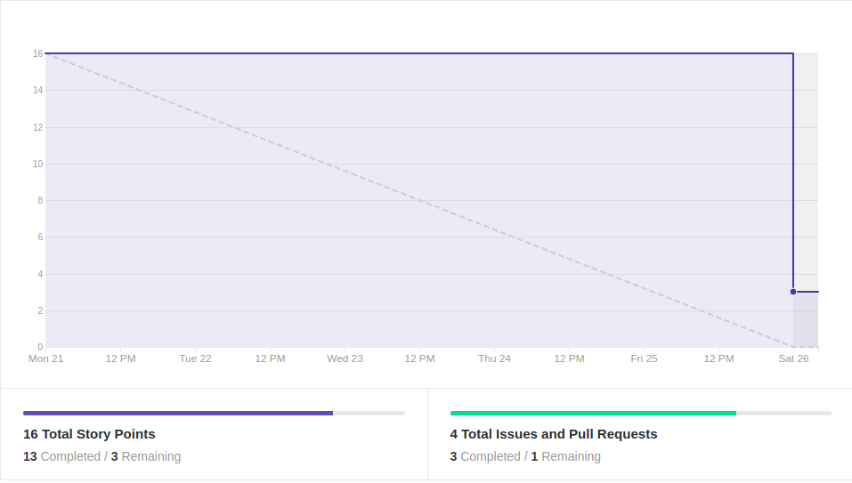
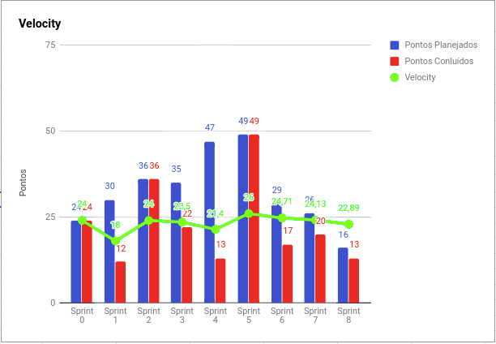
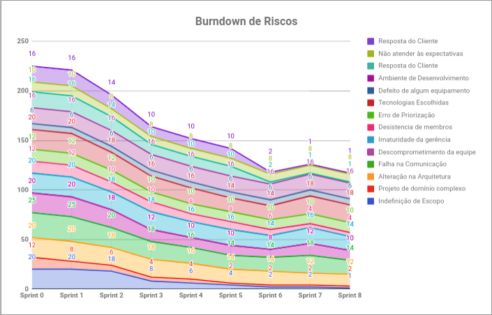
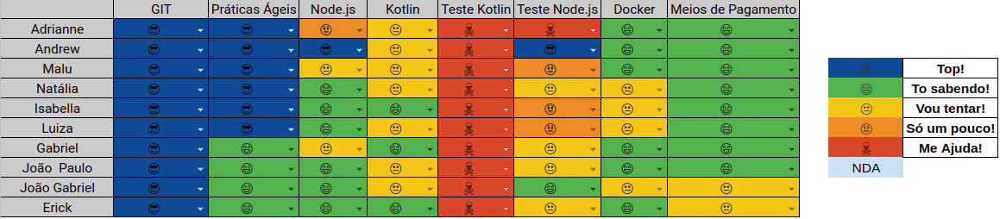

EPS

# Resultados 

## 1. Indicadores de Produtividade da Equipe

### 1.1 Fechamento da Sprint 

**Pontos concluídos: 13 pontos**
 
**Dívida Técnica: 3 pontos**

| Atividade | Situação |
| --------  | :----:   |
|[TS09 - Refatorar Confirmação de Parcelamento](https://github.com/fga-eps-mds/2019.2-over26/issues/114) | Concluída | 
|[US01 - Interface Cash Out - Integração](https://github.com/fga-eps-mds/2019.2-over26/issues/112) | Dívida Técnica |
| [Estudar notificações](https://github.com/fga-eps-mds/2019.2-Over26/issues/123)|Concluída |
| [TS06 - Testes das novas controllers - Backend](https://github.com/fga-eps-mds/2019.2-Over26/issues/99)| Concluída|

## 1.2 Burndown

## 1.3 Velocity 

## 1.4 Burndown de Riscos 

## 1.5 Retrospectiva 
| Membro | Pontos Positivos | Pontos Negativos | Sugestão de Melhoria | Pontuação das Histórias |
| --------  | :----:   | :----:   | :----:   | :----:   |
| Adrianne | Tarefas modulares, sprint menor, melhora da comunicação em relação à sprint anterior | Não consegui contribuir como gostaria com a revisão dos pull requests, problemas pessoais graves, baixo rendimento pessoal, membro disperso | Orientação e coordenação dos riscos do projeto, melhor divisão das tarefas | ok | |
| Andrew | Tarefas menores | Demora para começar a história, comunicação melhorou um pouco | melhorar comunicação, começar histórias mais cedo, revisar os prs mais rápido | OK |
| Maria Luiza | Sprint menor e com menos histórias | Comunicação e baixa produtividade da equipe, demora para entregar e analisar os PRs | Melhorar a comunicação e produtividade da equipe | OK |
| Natália | Mais histórias concluídas das que foram planejadas, MDS bem mais maduro. | Sprint menor e falta de tempo pra concluir algumas coisas pendentes minhas, fiquei um pouco distante do que estava acontecendo na sprint. | Melhor gerenciamento do meu tempo e melhor comunicação com o resto da equipe. | Ok |
| Isabella | Tarefas menores| Tempo pessoal disponivel curto | Maior dedicação pessoal | Ok |
| Luiza |Histórias de tamanhos melhores e mais possíveis de serem cumpridas. | Não pude participar da ultima reunião e por isso não fiquei sabendo as histórias dos outros pareamentos, fiquei um pouco perdida na sprint quanto ao resto da equipe. | Melhorar a comunicação. | Notificação 3 pontos |
| Gabriel | Histórias com tamanhos bons. | Desencontro com o pareamento gerou atraso na história, grupo desanimado com o projeto. | Tentar separar um tempo melhor para a diciplina. | OK | |
| Erick | Tarefas menores e bem detalhadas | Sprint pequena | Melhorar comunição e dedicação com o projeto | Notificação 3 pontos |
| João Gabriel |Tarefas menores.| Tarefa iniciada em cima da hora. | Começar antes a fazer as atividades. | OK.|
| João Paulo | Histórias bem divididas e menores |  Não contribui o suficiente, má programação do meu tempo | Melhora pessoal em relação ao tempo | Ok |

## 1.6 Quadro de conhecimento

# 2. Visão do Tech Leader
Essa sprint foi menor que as outras, devido a indisponibilidade da maioria da equipe em participar da reunião presencial de sábado. Este fato fez com que EPS tomasse a decisão de fazer uma sprint mais curta, com uma reunião de planejamento online. 

Devido ao fato da sprint ser menor, foi planejado menos pontos, a fim de que fosse concluídas todas as tarefas. Porém, não foi o que aconteceu, uma história de 3 pontos ficou como dívida, devido a indisponibilidade e má organização de tempo do pareamento responsável.

A demora para iniciar as histórias por parte da equipe de desenvolvimento tem atrapalhado bastante e comprometido as entregas da sprint. 

Uma melhoria que conseguimos aplicar desde a última sprint foi a de planejar histórias menores e concisas, o que tem facilitado as entregas e o desenvolvimento das mesmas. 

As práticas ágeis foram aplicadas, com reuniões diárias via Telegram e reuniões semanais de planejamento ocorrida no início da sprint (essa sprint foi feita online). Além das reuniões de retrospectiva e revisão ocorridas no final da sprint. Essas reuniões ocorrem todos os sábados presencialmente.
