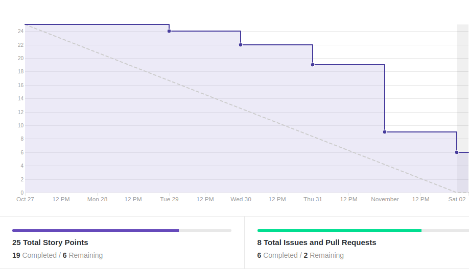
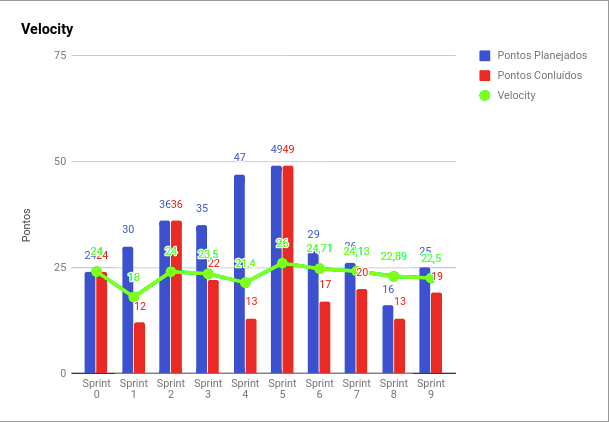
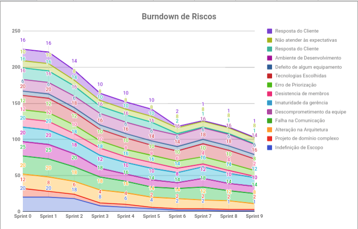
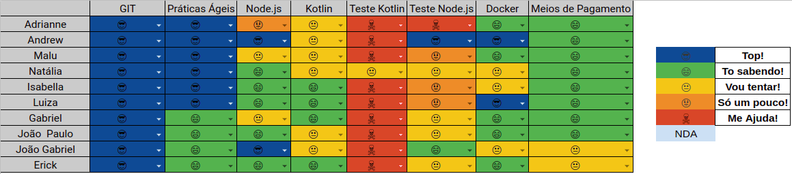

EPS

# Resultados 

## 1. Indicadores de Produtividade da Equipe

### 1.1 Fechamento da Sprint 

**Pontos concluídos: 19 pontos**
 
**Dívida Técnica: 6 pontos**

| Atividade | Situação |
| --------  | :----:   |
|[US14 - Acompanhar dívida - Design](https://github.com/fga-eps-mds/2019.2-Over26/issues/46) | Concluída | 
|[US14 - Acompanhar dívida - Integração]() |Concluída |
|[US14 - Acompanhar dívida - Back](https://github.com/fga-eps-mds/2019.2-Over26/issues/45) |Concluída |
| [US08 - Acompanhar período de insenção de juros - Backend](https://github.com/fga-eps-mds/2019.2-Over26/issues/128)| Dívida Técnica |
|[US08 - Acompanhar período de insenção de juros - Integração](https://github.com/fga-eps-mds/2019.2-Over26/issues/127) | Dívida Técnica |
|[Pagar Parcela - Back](https://github.com/fga-eps-mds/2019.2-Over26/issues/135) | Concluída|
|[Refatorar protótipo](https://github.com/fga-eps-mds/2019.2-Over26/issues/137) |Concluída |
|[US01 - Interface Cash Out - Integração](https://github.com/fga-eps-mds/2019.2-over26/issues/112) | Concluída |

## 1.2 Burndown

## 1.3 Velocity 

## 1.4 Burndown de Riscos 

## 1.5 Retrospectiva 
| Membro | Pontos Positivos | Pontos Negativos | Sugestão de Melhoria | Pontuação das Histórias |
| --------  | :----:   | :----:   | :----:   | :----:   |
| Adrianne | As issues começaram a ser resolvidas no início da sprint, muito melhor comunicação entre a equipe, Scrum master muito mais madura e agindo eficientemente nos riscos, equipe mais independente. | Não consegui contribuir homogeneamente ao longo da sprint | Organizar melhor minhas atividades no repositório | Ok | 
| Andrew | Melhora no burndown, deploy continuo do backend  | Cansaço e muitos bugs | Realizar um super pareamento MDS e EPS para solucionar bugs | ok | 
| Maria Luiza | Melhor organização da equipe, houve uma melhora significativa no burndown, entregas durante toda a sprint| Cansaço do fim do semestre, atividades de outras disciplinas, dividas técnicas | Resolver bugs e evitar deixar dívidas técnicas | OK | 
| Natália | MDS muito mais maduro e conseguindo entregar as histórias planejadas. Também conseguimos definir como faremos os testes de aceitação no frontend. | Chegando o final da disciplina e sprints um pouco mais pesadas, além das entregas das outras disciplinas. | Gerenciamento do tempo alocado para a disciplina. | Ok | 
| Isabella | ATividades feitas com antecedencia | mais atividades | gerenciar melhor o tempo | ok | 
| Luiza | Estamos finalizando as funcionalidades.| Muita coisa e por isso algumas estão confusas de entender. |Resolver bugs. | Ok | 
| Gabriel | O projeto está bem encaminhado. | Sprints pesadas. |- | OK | 
| Erick | Entregas constantes | Código complexo | Realizar correção de bugs | Ok | 
| João Gabriel |Ta acabando.|Cansaço de fim de semestre.|-|ok | 
| João Paulo | Historias curtas. | Cansaço e falta de tempo | - | Ok | 

## 1.6 Quadro de conhecimento

# 2. Visão do Tech Leader
Essa sprint foi muito valiosa e definiu bastante a produtividade de MDS. As histórias foram feitas durante toda a sprint, o que caracterizou uma boa produtividade. A equipe trabalhou muito bem, o que foi refletido no burndown. As duas dívidas foram devido à dificuldade técnica do pareamento em resolver um problema com o Backend, o que foi resolvido no fim da sprint e não deu tempo de finalizar todos os critérios de aceitação, ficando como dívida para a sprint 10. 

Acredito que estamos conseguindo chegar na produtividade máxima da equipe de desenvolvimento, o que tem sido de grande valia para o projeto. Pois estamos conseguindo entregar as principais features programadas para serem entregues e o projeto está fluindo bem. 

Foi necessário realizar uma adaptação no escopo do projeto, para que fosse possível realizar o fluxo principal da funcionalidade de Cheque Especial e realizar alguns testes com usuários, a fim de validar o fluxo. 

As práticas ágeis foram aplicadas, com reuniões diárias via Telegram e reuniões semanais de planejamento ocorrida no início da sprint. Além das reuniões de retrospectiva e revisão ocorridas no final da sprint. Essas reuniões ocorrem todos os sábados presencialmente.
